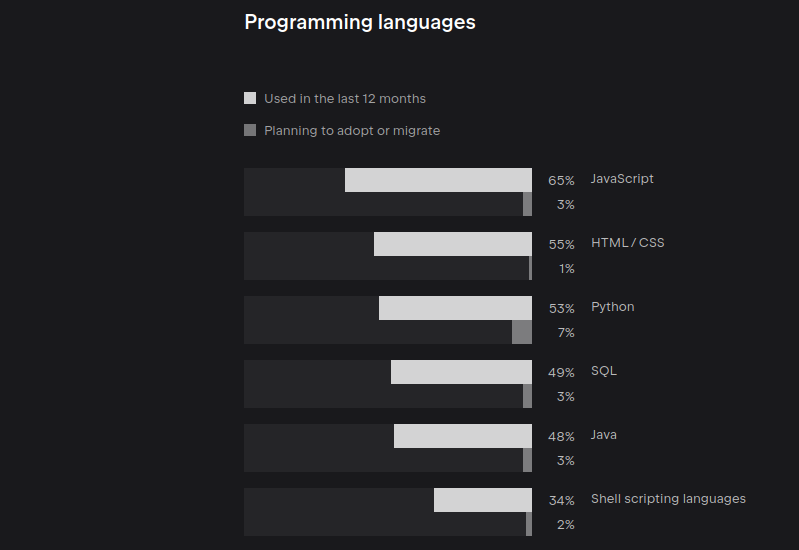
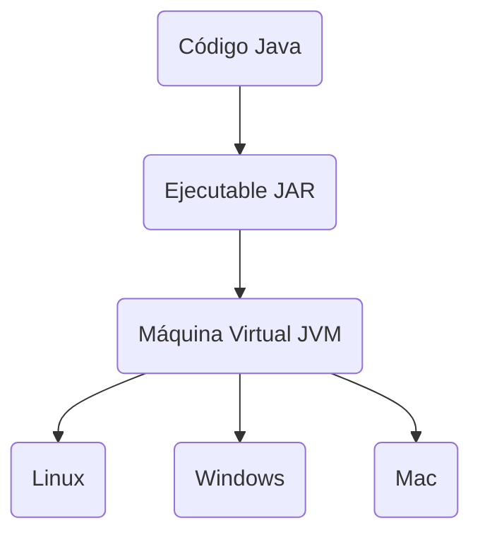

# Java Orientado a Objetos

Tablero en [trello](https://trello.com/b/dSotNCw1/g5-formaci%C3%B3n-java)

## Java [primeros pasos](https://app.aluracursos.com/course/java-primeros-pasos)

### ¿Que es Java?

Algunas [estadisticas](https://www.jetbrains.com/es-es/lp/devecosystem-2022/java/)
de jetbrains (2022).



#### Máquina Virtual Java - JVM

<style>div.mermaid{text-align: center;}</style>



ej. código Java

```java
package com.alura.java;

public class Persona {
    
    String nombre;
    String apellido,
    int edad;

    void datosDefault() {
        this.nombre = "Diego";
        this.apellido = "Arguelles";
        this.edad = 28;
    }

}
```

ej. bytecode

```java
{
  java.lang.String nombre;
    descriptor: Ljava/lang/String;
    flags: (0x0000)

  java.lang.String apellido;
    descriptor: Ljava/lang/String;
    flags: (0x0000)

  int edad;
    descriptor: I
    flags: (0x0000)

  public com.alura.java.Persona();
    descriptor: ()V
    flags: (0x0001) ACC_PUBLIC
    Code:
      stack=1, locals=1, args_size=1
         0: aload_0
         1: invokespecial #1                  // Method java/lang/Object."<init>":()V
         4: return
      LineNumberTable:
        line 3: 0

  void datosDefault();
    descriptor: ()V
    flags: (0x0000)
    Code:
      stack=2, locals=1, args_size=1
         0: aload_0
         1: ldc           #7                  // String Diego
         3: putfield      #9                  // Field nombre:Ljava/lang/String;
         6: aload_0
         7: ldc           #15                 // String Arguelles
         9: putfield      #17                 // Field apellido:Ljava/lang/String;
        12: aload_0
        13: bipush        28
        15: putfield      #20                 // Field edad:I
        18: return
      LineNumberTable:
        line 10: 0
        line 11: 6
        line 12: 12
        line 13: 18
}
```

#### Características de JVM

- Administración de memoria
- Multiplataforma
- Seguridad
- Optimización
- Librerías

Otros lenguajes soportados por la máquina virtual de Java son:
***Ruby, Scala, Python, Groovy, Clojure***

Principales características de Java:

- Orientado a objetos
- Parecido a C++
- Muchas librerías y una gran comunidad
- Para ejecutar el Bytecode necesitamos tener la máquina virtual de Java
- El Bytecode es independiente del sistema operativo

Principales componentes de la plataforma Java:

- Java Virtual Machine (JVM)
- Lenguaje Java
- Librerias Java (API)

#### Youtube alura [JVM](https://youtu.be/GrEO8nZzyZM)

Archivo [`HolaMundo.java`](./yt_alura_jvm/HolaMundo.java)

```java
public class HolaMundo {
    public static void main(String[] args) {
        System.out.println("Hola Mundo!");
    }
}
```

- Compilar: `javac HolaMundo.java`
- Correr: `java HolaMundo`
- Salida: `Hola Mundo!`

Archivo [`HolaMundo.class`](./yt_alura_jvm/HolaMundo.class) en formato hexadecimal
con `:%!xxd` en **vim**

```hex
00000000: cafe babe 0000 0040 001d 0a00 0200 0307  .......@........
00000010: 0004 0c00 0500 0601 0010 6a61 7661 2f6c  ..........java/l
00000020: 616e 672f 4f62 6a65 6374 0100 063c 696e  ang/Object...<in
00000030: 6974 3e01 0003 2829 5609 0008 0009 0700  it>...()V.......
00000040: 0a0c 000b 000c 0100 106a 6176 612f 6c61  .........java/la
00000050: 6e67 2f53 7973 7465 6d01 0003 6f75 7401  ng/System...out.
00000060: 0015 4c6a 6176 612f 696f 2f50 7269 6e74  ..Ljava/io/Print
00000070: 5374 7265 616d 3b08 000e 0100 0b48 6f6c  Stream;......Hol
00000080: 6120 4d75 6e64 6f21 0a00 1000 1107 0012  a Mundo!........
00000090: 0c00 1300 1401 0013 6a61 7661 2f69 6f2f  ........java/io/
000000a0: 5072 696e 7453 7472 6561 6d01 0007 7072  PrintStream...pr
000000b0: 696e 746c 6e01 0015 284c 6a61 7661 2f6c  intln...(Ljava/l
000000c0: 616e 672f 5374 7269 6e67 3b29 5607 0016  ang/String;)V...
000000d0: 0100 0948 6f6c 614d 756e 646f 0100 0443  ...HolaMundo...C
000000e0: 6f64 6501 000f 4c69 6e65 4e75 6d62 6572  ode...LineNumber
000000f0: 5461 626c 6501 0004 6d61 696e 0100 1628  Table...main...(
00000100: 5b4c 6a61 7661 2f6c 616e 672f 5374 7269  [Ljava/lang/Stri
00000110: 6e67 3b29 5601 000a 536f 7572 6365 4669  ng;)V...SourceFi
00000120: 6c65 0100 0e48 6f6c 614d 756e 646f 2e6a  le...HolaMundo.j
00000130: 6176 6100 2100 1500 0200 0000 0000 0200  ava.!...........
00000140: 0100 0500 0600 0100 1700 0000 1d00 0100  ................
00000150: 0100 0000 052a b700 01b1 0000 0001 0018  .....*..........
00000160: 0000 0006 0001 0000 0001 0009 0019 001a  ................
00000170: 0001 0017 0000 0025 0002 0001 0000 0009  .......%........
00000180: b200 0712 0db6 000f b100 0000 0100 1800  ................
00000190: 0000 0a00 0200 0000 0300 0800 0400 0100  ................
000001a0: 1b00 0000 0200 1c0a                      ........
```

Oracle Docs [Opcode Mnemonics](https://docs.oracle.com/javase/specs/jvms/se8/html/jvms-7.html)

`javap -c HolaMundo`

```java
Compiled from "HolaMundo.java"
public class HolaMundo {
  public HolaMundo();
    Code:
       0: aload_0
       1: invokespecial #1                  // Method java/lang/Object."<init>":()V
       4: return

  public static void main(java.lang.String[]);
    Code:
       0: getstatic     #7                  // Field java/lang/System.out:Ljava/io/PrintStream;
       3: ldc           #13                 // String Hola Mundo!
       5: invokevirtual #15                 // Method java/io/PrintStream.println:(Ljava/lang/String;)V
       8: return
```

### Primeros Pasos

```mermaid
flowchart LR
subgraph <b>JDK</b>
subgraph <b>JRE</b>
  c(JVM)
  style c fill:#f9f,stroke:#333,stroke-width:2px
  d(Librerías)
  style d fill:#f9f,stroke:#333,stroke-width:2px
end
  a(Tools)
end
```

#### Instalación

##### Archlinux

```sh
# última versión
sudo pacman -S jdk-openjdk

# Versiones LTS
# jdk8-openjdk
# jdk11-openjdk
# jdk17-openjdk
```

Cambiar la versión de Java a utlizar

```
# listar verisones instaladas
sudo archlinux-java status

# establecer versión a utilizar
sudo archlinux-java set java-20-openjdk
```

##### Ubuntu

```sh
sudo apt install openjdk-17-jdk

# headless
# sudo apt install openjdk-17-jdk-headless
```

Exportar variable `JAVA_HOME`

```sh
# Buscar ruta de instalación
sudo update-alternatives --config java

# o 
whereis java

# agregar en .bashrc
export JAVA_HOME=<ruta_a_bins_java>
```

##### Comprobar instalación

```sh
javac --version
javac 20.0.1
```

```sh
java --version
openjdk 20.0.1 2023-04-18
OpenJDK Runtime Environment (build 20.0.1+9)
OpenJDK 64-Bit Server VM (build 20.0.1+9, mixed mode, sharing)
```

**Java** es un lenguaje de programación que se actualiza periódicamente por **Oracle**,
la empresa responsable de su desarrollo. Cada nueva versión de Java trae consigo
nuevas características, mejoras de rendimiento, correcciones de errores y
actualizaciones de seguridad. Estas versiones se numeran, siguiendo un patrón
específico.

Cuando se lanza una nueva versión, puede incluir nuevas bibliotecas, clases,
métodos y otros recursos que los desarrolladores pueden utilizar para crear
aplicaciones Java más eficientes y con menos errores.

Aquí hay algunos ejemplos de algunas de las principales versiones de Java y sus
características:

- [Java **8**](https://www.java.com/es/download/help/java8_es.html#:~:text=Una%20de%20las%20funciones%20destacables,el%20lenguaje%20de%20programaci%C3%B3n%20Java.&text=Esta%20nueva%20API%20permitir%C3%A1%20a,natural%20y%20f%C3%A1cil%20de%20comprender)  
  Introdujo la programación funcional, incluyendo la **interfaz** `java.util.function`,
  que permite el uso de expresiones lambda. Además, se agregó una nueva API de
  fecha y hora que proporciona una forma más simple y segura de manejar fechas y horas.

- Java **11**  
  Introdujo el sistema de módulos de Java, que ayuda a simplificar la creación y
  mantenimiento de aplicaciones complejas. Además, se agregó la **clase** `HttpClient`,
  que admite comunicaciones HTTP/2.

- Java **15**  
  Agregó características como la palabra clave `sealed`, que permite que las
  clases restrinjan qué otras clases pueden extenderlas o implementarlas,
  y también agregó mejoras a la API Records, que ayuda a simplificar la creación
  de clases de datos inmutables.

- [Java **17**](https://www.oracle.com/cl/news/announcement/oracle-releases-java-17-2021-09-14/)  
  Introduce nuevas características y mejoras, como patrones de coincidencia que
  mejoran la sintaxis al trabajar con estructuras de datos complejas. Además,
  se mejoran el rendimiento del recolector de basura para reducir la latencia en
  las aplicaciones Java.  
  También se agregan funcionalidades a los registros, que
  son clases inmutables y compactas utilizadas para representar datos, incluyendo
  la capacidad de definir registros locales dentro de métodos.  
  Otra adición importante son las nuevas clases y métodos en el paquete
  `java.util` para trabajar con estructuras de datos persistentes, lo que permite
  realizar cambios en los datos sin modificar las estructuras originales.  
  Por último, se agrega soporte para **CGroups** en la API de Java, lo que permite
  una mejor administración de recursos en entornos de contenedores.

Al actualizar a una nueva versión de Java, es importante tener en cuenta la
compatibilidad con versiones anteriores. A veces, se eliminan o modifican
características o funcionalidades en una nueva versión, lo que puede afectar el
código existente. Por esta razón, es importante probar su código al actualizar
a una nueva versión de Java.

Además, es posible que coexistan diferentes versiones de Java en un sistema,
lo que permite que las aplicaciones se ejecuten en versiones específicas de la JVM
(Java Virtual Machine) para garantizar la compatibilidad con el código existente.

Otras características de las
[diferentes versiones de Java](https://www.aluracursos.com/blog/caracteristica-destacables-java8-delante).

### IDE

#### Eclipse

Instalación desde AUR, o descarga desde
[eclipse.org](https://www.eclipse.org/downloads/packages/)

#### IntelliJ IDEA

```sh
sudo pacman -S intellij-idea-community-edition
```

Al crear projectos con IDEs estos crean la estrucutura principal del proyecto y al
compilar guardan los bytecodes en un directorio distinto de donde esta el codigo
fuente.

Para correr un archivo bytecode en otra ruta se puede usar el flag `--clas-path`.

ej. [proyecto](./intellij_idea/java_primeros_pasos/) creado con IntelliJ IDEA

```sh
java --class-path ./intellij_idea/java_primeros_pasos/out/production/java_primeros_pasos/ Ejemplo
```

### Tipos y Variables

#### Tipo entero

