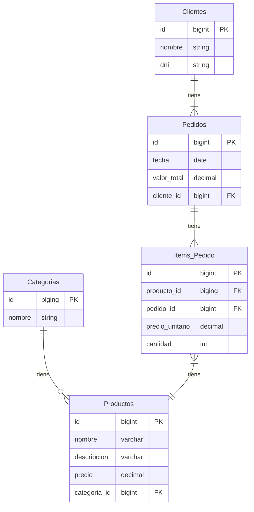

# JPA Avanzado

<style>div.mermaid{text-align: center;}</style>

Trabajando sobre el [proyecto](./jpa/tienda/src/main/java/com/latam/alura/tienda/)
anterior



## H2

Alias para manejar H2

```bash
alias h2server='java -cp ${HOME}/.m2/repository/com/h2database/h2/2.2.222/h2-2.2.222.jar org.h2.tools.Server -tcpAllowOthers -pgAllowOthers'
alias h2console='java -jar ${HOME}/.m2/repository/com/h2database/h2/2.2.222/h2-2.2.222.jar'
```

- Creación de base de datos `h2console`

### H2 en modo servidor

```bash
h2server

TCP server running at tcp://127.0.1.1:9092 (others can connect)
PG server running at pg://127.0.1.1:5435 (others can connect)
Web Console server running at http://127.0.1.1:8082 (only local connections)
```


En [pom.xml](./jpa/tienda2/pom.xml) cambiar la `url` para usar base de datos
creada anteriormente

```xml
...
<properties>
  ...
  <property name="javax.persistence.jdbc.url"
   value="jdbc:h2:tcp://127.0.1.1:9092//ruta/database;DATABASE_TO_UPPER=false;AUTO_SERVER=false"/>
  ...
</properties>
...
```

#### Sumario Aula 1

- Mapeo de nuevas entidades en la aplicación según el modelado de la base de
datos
- Mapeo de relación con cardinalidad de muchos a muchos
- Mapeo de relación bidireccional
- Persistencia entidades que tienen relaciones bidireccionales


### Funciones de agregación SQL

| Función | Descripción |
| - | - |
| **AVG** | Calcula el promedio de los valores de un campo |
| **COUNT** | Devuelve en número de registros de la selección |
| **SUM** | Devuelve la suma de todos los valores de  un campo |
| **MAX** | Devuelve el valor más alto de un campo |
| **MIN** | Devuelve el valor más bajo de un campo |

#### Reporte de ventas

| PRODUCTO | CANT. VENDIDA | ULTIMA VENTA |
| - | :-: | - |
| Celular Motorola X9 | 240 | 01/02/23 |
| Xbox Series S | 198 | 10/02/23 |
| Framework Laptop | 71 | 20/02/2023 |

<br>

**NamedQuerys**: Estas se declaran en la clase de entidad.

#### Sumario Aula 2

- Realización de consultas utilizando funciones de agregación (**min, max, avg
y sum**)
- Consultas de reporte/informes usando JPQL
- Uso del nuevo recurso seleccionado en consultas JPQL
- Consultas mediante **NamedQuerys**


