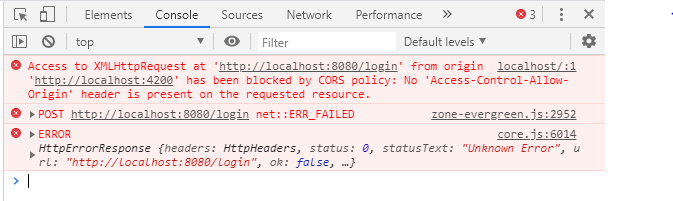

# Desarrollo de API Rest Java

### Proyecto

Desarrollo de "clínica médica"

### Objetivos

- Creación de una API Rest
- CRUD (Create, Read, Update, Delete)
- Validaciones
- Paginación y orden

### Tecnologias

- Spring Boot 3
- Java 17
- Lombok
- MySQL/Flyway
- JPA/Hibernate
- Maven
- Insomnia

## Spring initializr

Spring [initializr](https://start.spring.io/)

> Artículo
[cambios principales en versiones](https://www.aluracursos.com/blog/caracteristica-destacables-java8-delante)
de java

### Spring y Spring Boot

Spring es un framework para desarrollar aplicaciones en Java, creado a mediados
de 2002 por *Rod Johnson*, que se ha vuelto muy popular y adoptado en todo el
mundo debido a su simplicidad y facilidad de integración con otras tecnologías.

Se desarrolló de forma modular, en el que cada recurso que proporciona está
representado por un módulo, que se puede agregar a una aplicación según sea
necesario. Con esto, en cada aplicación podemos agregar solo los módulos que
tengan sentido, haciéndola así más liviana. Hay varios módulos en Spring,
cada uno con un propósito diferente, tales como:

- módulo MVC, para desarrollar aplicaciones Web y API's Rest
- módulo de Security, para manejar el control de autenticación y autorización
de las aplicaciones
- módulo Transactions, para gestionar el control transaccional

Sin embargo, uno de los mayores problemas de las aplicaciones que usaban Spring
era la parte de configuración de sus módulos, que se hacía íntegramente con
archivos XML, y después de unos años el framework también comenzó a soportar
configuraciones a través de clases Java, utilizando principalmente anotaciones.
En ambos casos, dependiendo del tamaño y complejidad de la aplicación, así
como de la cantidad de módulos Spring utilizados en ella, dichas configuraciones
eran bastante extensas y difíciles de mantener.

Además, iniciar un nuevo proyecto con Spring era una tarea bastante complicada,
debido a la necesidad de realizar este tipo de configuraciones en el proyecto.

Precisamente para solventar tales dificultades, a mediados de 2014 se creó un
nuevo módulo Spring, denominado ***Boot***, con el objetivo de agilizar la
creación de un proyecto que utilice Spring como framework, así como simplificar
las configuraciones de sus módulos.

El lanzamiento de Spring Boot fue un hito para el desarrollo de aplicaciones
Java, ya que hizo más simple y ágil esta tarea, facilitando mucho la vida de
las personas que utilizan el lenguaje Java para desarrollar sus aplicaciones.

La versión 3 de Spring Boot se lanzó en noviembre de 2022 y algunas de sus
nuevas características principales son:

- Compatibilidad con Java 17
- Migración de especificaciones Java EE a Jakarta EE
- Compatibilidad con imágenes nativas
- Lista completa de las novedades de Spring Boot 3 en:
[Release Notes 3.0](https://github.com/spring-projects/spring-boot/wiki/Spring-Boot-3.0-Release-Notes)

### Creación del proyecto

[.zip](./api_rest/api.zip) Generado con Spring boot initializr

Configuración adicional en IntelliJ IDE para evitar reinicio manual


Estructura del proyecto [vall_api](./api_rest/api)

```txt
api
├── .idea/
├── .mvn/
├── src
│   ├── main
│   │   ├── java
│   │   │   └── med
│   │   │       └── voll
│   │   │           └── api
│   │   │               ├── controller
│   │   │               │   └── HelloController.java
│   │   │               └── ApiApplication.java
│   │   └── resources/
│   └── test/
├── target/
├── .gitignore
├── HELP.md
├── mvnw
├── mvnw.cmd
└── pom.xml
```


### Utilizando Insomnia

AppImage de [Insomnia](https://github.com/Kong/insomnia/releases/) para probar API

Test post a `http://127.0.0.1:8080/medicos`, **json**

```json
{
    "nombre": "Rodrigo Lopez",
    "email": "rodrigo.lopez@voll.med",
    "documento": "123456",
    "especialidad": "ortopedia",
    "direccion": {
        "calle": "calle 1",
        "distrito": "distrito 1",
        "ciudad": "Lima",
        "numero": "1",
        "complemento": "a"
    }
}
```

#### JSON

**JSON** (JavaScript Object Notation) es un formato utilizado para representar
información, al igual que **XML** y **CSV**.

Una API necesita recibir y devolver información en algún formato que represente
los recursos que administra. **JSON** es uno de estos posibles formatos, popular
por su ligereza, sencillez, facil lectura (humana y máquina), así como por su
soporte para diferentes lenguajes de programación.

Representación de información en formato **XML**

```xml
<producto>
    <nombre>Mochila</nombre>
    <precio>89.90</precio>
    <descripcion>Mochila para notebooks de hasta 17 pulgadas</descripcion>
</producto>
```

Representación en formato **JSON**

```json
{
    "nombre" : "Mochila",
    "precio" : 89.90,
    "descripcion" : "Mochila para notebooks de hasta 17 pulgadas"
}
```

Observe cómo el formato JSON es mucho más compacto y legible. Precisamente por eso, se ha convertido en el formato universal utilizado en la comunicación de aplicaciones, especialmente en el caso de las API REST.

Más detalles sobre [JSON](https://www.json.org/json-es.html)

#### CORS

Al desarrollar una API y se busca que sus recursos estén disponibles para
cualquier ***cliente HTTP***.

**CORS** (Cross-Origin Resource Sharing) o “Intercambio de recursos con
diferentes orígenes”. Es común tener errores CORS al consumir y poner a
disposición una API.



**CORS** es un mecanismo utilizado para agregar encabezados HTTP que indica a
los navegadores permitir que una aplicación web se ejecute en un origen y acceda
a los recursos desde un origen diferente. Este tipo de acción se denomina
***cross-origin HTTP request***.
En la práctica, les informa a los navegadores si se puede acceder o no a un
recurso en particular.

Entendiendo los errores

***`Same-origin policy`***  
Por defecto, una aplicación Front-end, escrita en JavaScript, solo puede acceder
a los recursos ubicados en el mismo origen de la solicitud. Esto sucede debido
a la política del mismo origen (*same-origin policy*), que es un mecanismo de
seguridad de los navegadores que restringe la forma en que un documento o script
de un origen interactúa con los recursos de otro.
Esta política tiene como objetivo detener los ataques maliciosos.

Dos URL comparten el mismo origen si el **protocolo**, el **puerto** (si se
especifica) y el **host** son los mismos. Comparemos posibles variaciones
considerando la URL `https://cursos.alura.com.br/category/programacao`:

| URL | Resultado | Motivo |
| - | - | - |
| `https://cursos.alura.com.br/category/front-end` | Mismo origen | Solo camino diferente |
| `http://cursos.alura.com.br/category/programacao` |Error de CORS | Protocolo diferente (http) |
| `https://faculdade.alura.com.br:80/category/programacao` | Error de CORS | Host diferente |

#### ¿Como consumir una API con una URL diferente sin tener problemas CORS?

Por ejemplo, si se quiere consumir una API que se ejecuta en el puerto `8000` desde
una aplicación React corriendo en el puerto `3000`.

Al enviar una solicitud a una API de origen diferente, la API debe devolver un
header llamado `Access-Control-Allow-Origin`. Dentro de esta, es ella es necesario
informar los diferentes orígenes que serán permitidas de consumir la API, en
este caso: `Access-Control-Allow-Origin: http://localhost:3000`.

Para permitir el acceso desde cualquier origen se utiliza el símbolo `*`:
`Access-Control-Allow-Origin: *`. Esta es una medida **no recomendada**, ya que
permite que fuentes desconocidas accedan al servidor, a menos que sea intencional,
como en el caso de una API pública.

**¿Cómo hacer esto en Spring Boot correctamente?**

#### Habilitando diferentes orígenes en Spring Boot

Configurar el **CORS** para permitir que un origen específico consuma la API,
creando una clase de configuración como la sgte.

```java
@Configuration
public class CorsConfiguration implements WebMvcConfigurer {

    @Override
    public void addCorsMappings(CorsRegistry registry) {
        registry.addMapping("/**")
            .allowedOrigins("http://localhost:3000")
            .allowedMethods("GET", "POST", "PUT", "DELETE",
                    "OPTIONS", "HEAD", "TRACE", "CONNECT");
    }
}
```

`http://localhost:3000` sería la dirección de la aplicación Front-end y
`.allowedMethods` los métodos que se permitirán ejecutar. Con esto se podrá
consumir la API sin problemas desde una aplicación front-end.

#### Restricciones o validaciones

|| Médico ||
| :- | :- | :- |
| Nombre | Solo letras | No puede llegar vacío |
| Especialidad | Ortopedia, Ginecología,<br>Cardiología, Pediatria | No puede llegar vacío |
| Documento | Solo números | No puede llegar vacío |
| Email | Formato de email | No puede llegar vacío |
| Teléfono | Solo números | No puede llegar vacío |

|| Dirección ||
| :- | :- | :- |
| Calle | Letras y números | No puede llegar vacío |
| Número | Solo números | No puede llegar vacío |
| Complemento | Letras y números | |
| Cuidad | Letras y números | No puede llegar vacío |

### Java Record

Lanzado oficialmente en Java 16, pero disponible experimentalmente desde Java 14.
**Record** es un recurso que ***permite representar una clase inmutable, que
contiene solo atributos, constructor y métodos de lectura***, de una manera muy
simple y ágil.

Este tipo de clase encaja perfectamente para representar **clases DTO**, ya que
su objetivo es únicamente representar datos que serán recibidos o devueltos por
la API, sin ningún tipo de comportamiento.

Para crear una clase DTO inmutable, sin la utilización de Record, era necesario
escribir mucho código. El sgte. es un ejemplo de una clase DTO que representa
un teléfono:

```java
public final class Telefono {

    private final String ddd;
    private final String numero;

    public Telefono(String ddd, String numero) {
        this.ddd = ddd;
        this.numero = numero;
    }

    @Override
    public int hashCode() {
        return Objects.hash(ddd, numero);
    }

    @Override
    public boolean equals(Object obj) {
        if (this == obj) {
            return true;
        } else if (!(obj instanceof Telefono)) {
            return false;
        } else {
            Telefono other = (Telefono) obj;
            return Objects.equals(ddd, other.ddd)
              && Objects.equals(numero, other.numero);
        }
    }

    public String getDdd() {
        return this.ddd;
    }

    public String getNumero() {
        return this.numero;
    }
}
```

Con **Record** el código anterior se resume en una sola línea:

```java
public record Telefono(String ddd, String numero) {}
```

Internamente, Java transforma este registro en una clase inmutable, muy similar
al código que se muestra arriba.

Documentación Java
[record](https://docs.oracle.com/en/java/javase/17/language/records.html)


## Agregando dependencias

Copiar `xml` de Spring [initializr](https://start.spring.io/), y pegar en `pom.xml`

Modificar `resources/application.properties`

```ini
spring.datasource.url=jdbc:mysql://<URL>/vollmed-api
spring.datasource.username=<USER>
spring.datasource.password=<PASS>
```

Recomendaciones [12 Factor App](https://12factor.net/es/), que define las 12
mejores prácticas para crear aplicaciones modernas, escalables y de mantenimiento
sencillo.

En algunos proyectos Java, dependiendo de la tecnología elegida, es común
encontrar clases que siguen el patrón DAO, usado para aislar el acceso a los
datos. Sin embargo, en este curso usaremos otro patrón, conocido como
***Repositorio***.

***¿cuál es la diferencia entre los dos enfoques y por qué esta elección?***

#### Patrón DAO

El patrón de diseño DAO, también conocido como **Data Access Object**, se
utiliza para la persistencia de datos, donde su objetivo principal es separar
las reglas de negocio de las reglas de acceso a la base de datos. En las clases
que siguen este patrón, aislamos todos los códigos que se ocupan de conexiones,
comandos SQL y funciones directas a la base de datos, para que dichos códigos
no se esparzan a otras partes de la aplicación, algo que puede dificultar el
mantenimiento del código y también el intercambio de tecnologías y del mecanismo
de persistencia.

Implementación  
Supongamos que tenemos una tabla de productos en nuestra base de datos. La
implementación del ***patrón DAO*** sería la sgte:

Primero, será necesario crear una clase básica de dominio Producto:

```java
public class Producto {
    private Long id;
    private String nombre;
    private BigDecimal precio;
    private String descripcion;

    // constructores, getters y setters
}
```

A continuación, necesitaríamos crear la clase ProductoDao, que proporciona
operaciones de persistencia para la clase de dominio Producto:

```java
public class ProductoDao {

    private final EntityManager entityManager;

    public ProductoDao(EntityManager entityManager) {
        this.entityManager = entityManager;
    }

    public void create(Producto producto) {
        entityManager.persist(producto);
    }

    public Producto read(Long id) {
        return entityManager.find(Producto.class, id);
    }

    public void update(Producto producto) {
        entityManger.merge(producto);
    }

    public void remove(Producto producto) {
        entityManger.remove(producto);
   }

}
```

En el ejemplo anterior, se utilizó JPA como tecnología de persistencia de datos
de la aplicación.

**Patrón Repository**. Según el famoso libro Domain-Driven Design de Eric Evans:

El repositorio es un mecanismo para encapsular el almacenamiento, recuperación y
comportamiento de búsqueda, que emula una colección de objetos.

En pocas palabras, un repositorio también maneja datos y oculta consultas
similares a DAO. Sin embargo, se encuentra en un nivel más alto, más cerca de
la lógica de negocio de una aplicación. Un repositorio está vinculado a la
regla de negocio de la aplicación y está asociado con el agregado de sus objetos
de negocio, devolviéndolos cuando es necesario.

Pero debemos estar atentos, porque al igual que en el patrón DAO, las reglas de
negocio que están involucradas con el procesamiento de información no deben estar
presentes en los repositorios. Los repositorios no deben tener la responsabilidad
de tomar decisiones, aplicar algoritmos de transformación de datos o brindar
servicios directamente a otras capas o módulos de la aplicación. Mapear entidades
de dominio y proporcionar funcionalidades de aplicación son responsabilidades muy
diferentes.

Un repositorio se encuentra entre las reglas de negocio y la capa de persistencia:

1. Proporciona una interfaz para las reglas comerciales donde se accede a los
objetos como una colección.
2. Utiliza la capa de persistencia para escribir y recuperar datos necesarios
para persistir y recuperar objetos de negocio.

Por lo tanto, incluso es posible utilizar uno o más DAOs en un repositorio.

***¿Por qué el patrón repositorio en lugar de DAO usando Spring?***

El patrón de repositorio fomenta un diseño orientado al dominio, lo que
proporciona una comprensión más sencilla del dominio y la estructura de datos.
Además, al usar el repositorio de Spring, no tenemos que preocuparnos por usar
la API de JPA directamente, simplemente creando los métodos, que Spring crea la
implementación en tiempo de ejecución, lo que hace que el código sea mucho más
simple, pequeño y legible.

### Validaciones

Bean Validation se compone de varias ***anotaciones*** que se deben agregar a los
atributos en los que queremos realizar las validaciones. Se implementaron algunas
de estas anotaciones, como **`@NotBlank`**, que indica que un atributo String no
puede ser nulo o vacío. (
[DatosRegistroMedico.java](./api_rest/api/src/main/java/med/voll/api/medico/DatosRegistroMedico.java)
)

Sin embargo, existen decenas de otras anotaciones que se pueden utilizar, para
los más diversos tipos de atributos.

Se puede consultar una lista de las principales anotaciones de **Bean Validation**
en la
[documentación oficial](https://jakarta.ee/specifications/bean-validation/3.0/jakarta-bean-validation-spec-3.0.html#builtinconstraints).

### Migraciones

Estas se crean en el directorio
[/src/db/migration/](./api_rest/api/src/main/resources/db/migration/). Es
importante detener siempre el proyecto al crear los archivos de migración, para
evitar que **Flyway** los ejecute antes de tiempo, con el código aún incompleto,
lo que podría causar problemas.

En caso de:

```sql
# Soft
DELETE FROM flyway_schema_history WHERE success = 0;

# Hard
DROP TABLE flyway_schema_history;
```

### Lombok

Es una biblioteca de Java especialmente enfocada en la reducción de código y
en la productividad en el desarrollo de proyectos.

Utiliza la idea de ***anotaciones***  para generar códigos en el tiempo de
compilación. Pero el código generado no es visible, y tampoco es posible cambiar
lo que se ha generado.

Puede ser una buena herramienta aliada a la hora de escribir clases complejas,
siempre que el desarrollador tenga conocimiento sobre ella. Para más información
ver la documentación de [Lombok](https://projectlombok.org/)

### Anotacion Autowired

En el contexto del framework Spring, que utiliza como una de sus bases el patrón
de diseño *"Inyección de Dependencias"*, la idea sirve para definir una
inyección automática en un determinado componente del proyecto Spring, ese
componente puede ser atributos, métodos e incluso constructores.

Esta anotación se permite por el uso de la anotación `@SpringBootApplication`,
en el archivo de configuración de Spring, disponible cada vez que se crea un
proyecto Spring.

Al marcar un componente con la anotación `@Autowired` le estamos diciendo a
Spring que el componente es un punto donde se debe inyectar una dependencia,
en otras palabras, el componente se inyecta en la clase que lo posee,
estableciendo una colaboración entre componentes.

Para más información sobre la anotación, ver la
[documentación oficial](https://docs.spring.io/spring-framework/docs/current/javadoc-api/org/springframework/beans/factory/annotation/Autowired.html)

