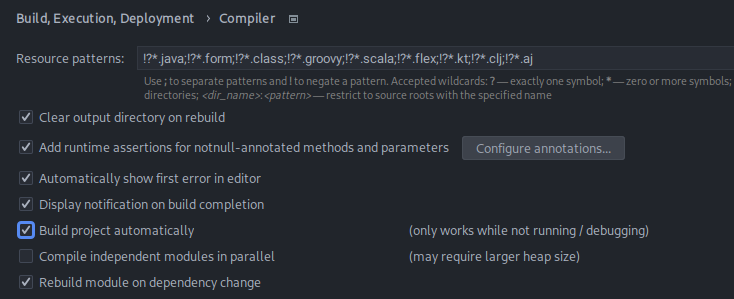
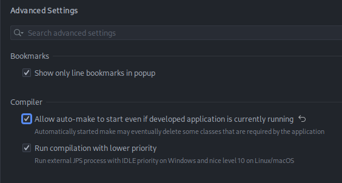

# Desarrollo de API Rest Java

### Proyecto

Desarrollo de "clínica médica"

### Objetivos

- Creación de una API Rest
- CRUD (Create, Read, Update, Delete)
- Validaciones
- Paginación y orden

### Tecnologias

- Spring Boot 3
- Java 17
- Lombok
- MySQL/Flyway
- JPA/Hibernate
- Maven
- Insomnia

## Spring initializr

Spring [initializr](https://start.spring.io/)

> Artículo
[cambios principales en versiones](https://www.aluracursos.com/blog/caracteristica-destacables-java8-delante)
de java

### Spring y Spring Boot

Spring es un framework para desarrollar aplicaciones en Java, creado a mediados
de 2002 por *Rod Johnson*, que se ha vuelto muy popular y adoptado en todo el
mundo debido a su simplicidad y facilidad de integración con otras tecnologías.

Se desarrolló de forma modular, en el que cada recurso que proporciona está
representado por un módulo, que se puede agregar a una aplicación según sea
necesario. Con esto, en cada aplicación podemos agregar solo los módulos que
tengan sentido, haciéndola así más liviana. Hay varios módulos en Spring,
cada uno con un propósito diferente, tales como:

- módulo MVC, para desarrollar aplicaciones Web y API's Rest
- módulo de Security, para manejar el control de autenticación y autorización
de las aplicaciones
- módulo Transactions, para gestionar el control transaccional

Sin embargo, uno de los mayores problemas de las aplicaciones que usaban Spring
era la parte de configuración de sus módulos, que se hacía íntegramente con
archivos XML, y después de unos años el framework también comenzó a soportar
configuraciones a través de clases Java, utilizando principalmente anotaciones.
En ambos casos, dependiendo del tamaño y complejidad de la aplicación, así
como de la cantidad de módulos Spring utilizados en ella, dichas configuraciones
eran bastante extensas y difíciles de mantener.

Además, iniciar un nuevo proyecto con Spring era una tarea bastante complicada,
debido a la necesidad de realizar este tipo de configuraciones en el proyecto.

Precisamente para solventar tales dificultades, a mediados de 2014 se creó un
nuevo módulo Spring, denominado ***Boot***, con el objetivo de agilizar la
creación de un proyecto que utilice Spring como framework, así como simplificar
las configuraciones de sus módulos.

El lanzamiento de Spring Boot fue un hito para el desarrollo de aplicaciones
Java, ya que hizo más simple y ágil esta tarea, facilitando mucho la vida de
las personas que utilizan el lenguaje Java para desarrollar sus aplicaciones.


La versión 3 de Spring Boot se lanzó en noviembre de 2022 y algunas de sus
nuevas características principales son:

- Compatibilidad con Java 17
- Migración de especificaciones Java EE a Jakarta EE
- Compatibilidad con imágenes nativas
- Lista completa de las novedades de Spring Boot 3 en:
[Release Notes 3.0](https://github.com/spring-projects/spring-boot/wiki/Spring-Boot-3.0-Release-Notes)

### Creación del proyecto

[.zip](./api_rest/api.zip) Generado con Spring boot initializr

Configuración adicional en IntelliJ IDE para evitar reinicio manual




Estructura del proyecto [vall_api](./api_rest/api)

```txt
api
├── .idea/
├── .mvn/
├── src
│   ├── main
│   │   ├── java
│   │   │   └── med
│   │   │       └── voll
│   │   │           └── api
│   │   │               ├── controller
│   │   │               │   └── HelloController.java
│   │   │               └── ApiApplication.java
│   │   └── resources/
│   └── test/
├── target/
├── .gitignore
├── HELP.md
├── mvnw
├── mvnw.cmd
└── pom.xml
```

