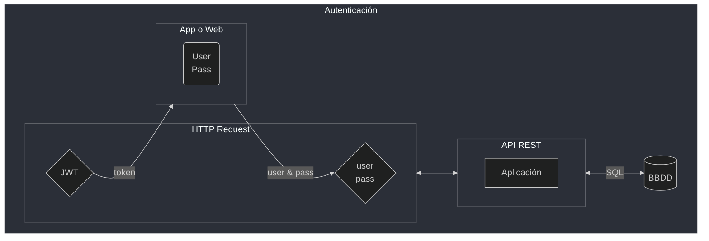

# API Rest Java - Buenas prácticas y protección

Continuación de [Desarrollo de una API Rest](./spring_boot_1.md) donde se vio:

- Creación de un API Rest
- Crud (Create, Read, Update, Delete)
- Validaciones
- Paginación y orden

### Objetivos

- Buenas prácticas al desarrollar un API
- Tratamiento de errores
- Autenticación y Autorización
- Tokens JWT

## Buenas prácticas

Se modifican las respuestas de la API

[DatosRespuestaMedico](./api_rest/api2/src/main/java/med/voll/api/medico/DatosRespuestaMedico.java)

```java
public record DatosRespuestaMedico(
                        @NotNull Long id, String nombre,
                        String email, String telefono, String documento,
                        DatosDireccion direccion) {}
```

[MedicoController](./api_rest/api2/src/main/java/med/voll/api/controller/MedicoController.java)

```java
@RestController
@RequestMapping("/medicos")
public class MedicoController {

    @Autowired
    private MedicoRepository medicoRepository;

    @PostMapping
    public ResponseEntity<DatosRespuestaMedico> registrarMedico(
                @RequestBody @Valid DatosRegistroMedico datosRegistroMedico,
                UriComponentsBuilder uriComponentsBuilder) {
        Medico medico = medicoRepository.save(new Medico(datosRegistroMedico));
        DatosRespuestaMedico datosRespuestaMedico = new DatosRespuestaMedico(
                medico.getId(),
                medico.getNombre(),
                medico.getEmail(),
                medico.getTelefono(),
                medico.getDocumento(),
                new DatosDireccion(
                        medico.getDireccion().getCalle(),
                        medico.getDireccion().getDistrito(),
                        medico.getDireccion().getCiudad(),
                        medico.getDireccion().getNumero(),
                        medico.getDireccion().getComplemento()
                )
        );
        URI url = uriComponentsBuilder.path("/medicos/{id}")
                    .buildAndExpand(medico.getId()).toUri();
        return  ResponseEntity.created(url).body(datosRespuestaMedico);
    }

    @GetMapping
    public Page<DatosListadoMedicos> listadoMedicos(@PageableDefault(size = 5)
                Pageable paginacion) {
        return medicoRepository.findByActivoTrue(paginacion)
                .map(DatosListadoMedicos::new);
    }

    @PutMapping
    @Transactional
    public ResponseEntity actualizarMedico(@RequestBody @Valid DatosActualizarMedico
        datosActualizarMedico) {
        Medico medico = medicoRepository.getReferenceById(datosActualizarMedico.id());
        medico.actualizarDatos(datosActualizarMedico);
        return ResponseEntity.ok(
            new DatosRespuestaMedico(
                medico.getId(),
                medico.getNombre(),
                medico.getEmail(),
                medico.getTelefono(),
                medico.getDocumento(),
                new DatosDireccion(
                        medico.getDireccion().getCalle(),
                        medico.getDireccion().getDistrito(),
                        medico.getDireccion().getCiudad(),
                        medico.getDireccion().getNumero(),
                        medico.getDireccion().getComplemento()
                )
        ));
    }

    @DeleteMapping("/{id}")
    @Transactional
    public ResponseEntity eliminarMedico(@PathVariable Long id) {
        Medico medico = medicoRepository.getReferenceById(id);
        medico.desactivarMedico();
        return ResponseEntity.noContent().build();
    }
}
```

## Codigos de respuesta del protocolo HTTP

El protocolo HTTP (***Hypertext Transfer Protocol***, *RFC 2616*) es el protocolo
encargado de realizar la comunicación entre el cliente, que suele ser un
navegador, y el servidor. De esta forma, para cada *solicitud* realizada por el
cliente, el servidor responde si tuvo éxito o no. Si no tiene éxito, la mayoría
de las veces, la respuesta del servidor será una secuencia numérica acompañada
de un mensaje.

Categoría de código
Los códigos **HTTP** (o **HTTPS**) tienen tres dígitos, y el primer dígito
representa la clasificación dentro de las cinco categorías posibles.

- **`1XX` Informativo:** la solicitud fue aceptada o el proceso aún está en curso
- **`2XX` Confirmación:** la acción se completó o se comprendió
- **`3XX` Redirección:** indica que se debe hacer o se debió hacer algo más para
completar la solicitud
- **`4XX` Error del cliente:** indica que la solicitud no se puede completar o
contiene una sintaxis incorrecta
- **`5XX` Error del servidor:** el servidor falló al concluir la solicitud.

### Principales códigos de error

Estos permiten comprender mejor la comunicación de su navegador con el servidor
de la aplicación que se intenta acceder.

#### Error 403

El código 403 es el error **"Prohibido"**. Significa que el servidor entendió
la solicitud del cliente, pero se niega a procesarla, ya que el cliente no está
autorizado para hacerlo.

#### Error 404

Mensaje de Error 404, significa que la URL no lo llevó a ninguna parte.
Puede ser que la aplicación ya no exista, que la URL haya cambiado o que haya
ingresado una URL incorrecta.

#### Error 500

Es un error menos común, pero aparece de vez en cuando. Este error significa que
hay un problema con una de las bases que hace que se ejecute una aplicación.
Básicamente, este error puede estar en el servidor que mantiene la aplicación
en línea o en la comunicación con el sistema de archivos, que proporciona la
infraestructura para la aplicación.

#### Error 503

El error 503 significa que el servicio al que se accede no está disponible
temporalmente. Las causas comunes son un servidor que está fuera de servicio
por mantenimiento o sobrecargado. Los ataques maliciosos como ***DDoS***
causan mucho este problema.


Para consultar sobre algún código HTTP, se puede usar la sgte. página:

[http cat](https://http.cat)

ejm consulta por código `405 Method Not Allowed`

```http
https://http.cat/405
```

## Manejando errores

- Spring boot common
[properties](https://docs.spring.io/spring-boot/docs/current/reference/html/application-properties.html)

- Spring boot server
[properties](https://docs.spring.io/spring-boot/docs/current/reference/html/application-properties.html#appendix.application-properties.server)

#### Ocultando el stacktrace

[application.properties](./api_rest/api2/src/main/resources/application.properties)

```conf
server.error.include-stacktrace=never
```

Nuevo package [infra](./api_rest/api2/src/main/java/med/voll/api/infra) con nueva
clase
[ManejadorDeErrores](./api_rest/api2/src/main/java/med/voll/api/infra/ManejadorDeErrores.java)

```java
...

@RestControllerAdvice
public class ManejadorDeErrores {

    @ExceptionHandler(EntityNotFoundException.class)
    public ResponseEntity manejarError404(){
        return  ResponseEntity.notFound().build();
    }

    @ExceptionHandler(MethodArgumentNotValidException.class)
    public ResponseEntity manejarError400(MethodArgumentNotValidException e){
        var errores = e.getFieldErrors().stream().map(DatosErrorValidacion::new).toList();
        return  ResponseEntity.badRequest().body(errores);
    }

    private record DatosErrorValidacion(String campo, String error) {
        public DatosErrorValidacion(FieldError error) {
            this(error.getField(), error.getDefaultMessage());
        }
    }
}
```

Por defecto, **Bean Validation** devuelve mensajes de error en inglés, sin
embargo, hay una traducción de estos mensajes al español ya implementada en
esta especificación.

En el protocolo HTTP hay un encabezado llamado `Accept-Language`, que sirve para
indicar al servidor el idioma preferido del cliente que activa la solicitud.
Podemos utilizar esta cabecera para indicarle a Spring el idioma deseado, para
que en la integración con Bean Validation pueda buscar mensajes según el idioma
indicado.

En Insomnia, y también en otras herramientas similares, existe una opción
llamada Header en la que podemos incluir cabeceras a enviar en la petición.
Si agregamos el encabezado `Accept-Language` con el valor `es`, los mensajes de
error de **Bean Validation** se devolverán automáticamente en español.

> Nota: Bean Validation solo traduce los mensajes de error a unos pocos idiomas.

### Personalización de mensajes de error

**Bean Validation** tiene un mensaje de error para cada una de sus anotaciones.
P.e. cuando la validación falla en algún atributo anotado con `@NotBlank`, el
mensaje de error será: `must not be blank`.

Estos mensajes de error no se definieron en la aplicación, ya que son mensajes
de error estándar de Bean Validation. Sin embargo, si lo desea, puede
personalizar dichos mensajes.

Una de las formas de personalizar los mensajes de error es agregar el atributo
del mensaje a las anotaciones de validación:

```java
public record DatosCadastroMedico(
    @NotBlank(message = "Nombre es obligatorio")
    String nombre,

    @NotBlank(message = "Email es obligatorio")
    @Email(message = "Formato de email es inválido")
    String email,

    @NotBlank(message = "Teléfono es obligatorio")
    String telefono,

    @NotBlank(message = "CRM es obligatorio")
    @Pattern(regexp = "\\d{4,6}", message = "Formato do CRM es inválido")
    String crm,

    @NotNull(message = "Especialidad es obligatorio")
    Especialidad especialidad,

    @NotNull(message = "Datos de dirección son obligatorios")
    @Valid DatosDireccion direccion) {}
```

Otra forma es aislar los mensajes en un archivo de propiedades, que debe tener
el nombre `ValidationMessages.properties` y estar creado en el directorio
`src/main/resources`:

```config
nombre.obligatorio=El nombre es obligatorio
email.obligatorio=Correo electrónico requerido
email.invalido=El formato del correo electrónico no es válido
phone.obligatorio=Teléfono requerido
crm.obligatorio=CRM es obligatorio
crm.invalido=El formato CRM no es válido
especialidad.obligatorio=La especialidad es obligatoria
address.obligatorio=Los datos de dirección son obligatorios
```

Y, en las anotaciones, indicar la clave de las propiedades por el propio atributo
message, delimitando con los caracteres `{` y `}`:

```java
public record DatosRegistroMedico(
    @NotBlank(message = "{nombre.obligatorio}")
    String nombre,

    @NotBlank(message = "{email.obligatorio}")
    @Email(message = "{email.invalido}")
    String email,

    @NotBlank(message = "{telefono.obligatorio}")
    String telefono,

    @NotBlank(message = "{crm.obligatorio}")
    @Pattern(regexp = "\\d{4,6}", message = "{crm.invalido}")
    String crm,

    @NotNull(message = "{especialidad.obligatorio}")
    Especialidad especialidad,

    @NotNull(message = "{direccion.obligatorio}")
    @Valid DatosDireccion direccion) {}
```

### Seguridad

- Autenticación
- Autorización
- Protección contra ataques (CSRF, clickjacking)



### Hash de contraseña

Al implementar una funcionalidad de autenticación en una aplicación,
independientemente del lenguaje de programación utilizado, deberá tratar con
los datos de inicio de sesión y contraseña de los usuarios, y deberán
almacenarse en algún lugar, como, por ejemplo, una base de datos.

Las contraseñas son información confidencial y no deben almacenarse en texto
sin formato, ya que si una persona malintencionada logra acceder a la base de
datos, podrá acceder a las contraseñas de todos los usuarios. Para evitar este
problema, siempre debe usar algún algoritmo hash en las contraseñas antes de
almacenarlas en la base de datos.

**Hashing** no es más que una función matemática que convierte un texto en otro
texto totalmente diferente y difícil de deducir. Por ejemplo, el texto *"Mi
nombre es Rodrigo"* se puede convertir en el texto
`8132f7cb860e9ce4c1d9062d2a5d1848`, utilizando el algoritmo ***hash MD5***.

Un detalle importante es que los algoritmos de hash deben ser unidireccionales,
es decir, no debe ser posible obtener el texto original a partir de un hash.
Así, para saber si un usuario ingresó la contraseña correcta al intentar
autenticarse en una aplicación, debemos tomar la contraseña que ingresó y
generar su hash, para luego compararla con el hash que está almacenado en la
base de datos.

Hay varios algoritmos hashing que se pueden usar para transformar las contraseñas
de los usuarios, algunos de los cuales son más antiguos y ya **no se consideran
seguros** en la actualidad, como **MD5** y **SHA1**. Los principales algoritmos
actualmente recomendados son:

- Bcrypt
- Scrypt
- Argon2
- PBKDF2

Se utilizará el algoritmo **BCrypt**, que es bastante popular hoy en día. Esta
opción también tiene en cuenta que ***Spring Security*** ya nos proporciona una
clase que lo implementa.

**Spring Data** usa su propio patrón de nomenclatura de métodos a seguir para
que pueda generar consultas SQL correctamente.

Hay algunas palabras reservadas que debemos usar en los nombres de los métodos,
como `findBy` y `existBy`, para indicarle a **Spring Data** cómo debe ensamblar
la consulta que queremos. Esta característica es bastante flexible y puede ser
un poco compleja debido a las diversas posibilidades existentes.

Para conocer más detalles y comprender mejor cómo ensamblar consultas dinámicas
con Spring Data, acceda a su
[documentación oficial](https://docs.spring.io/spring-data/jpa/docs/current/reference/html/).

Bcrypt [online](https://www.browserling.com/tools/bcrypt)

#### Autenticación API

Se agregan las dependencias

[pom.xml](./api_rest/api2/pom.xml)

```xml
    ...
        <dependency>
            <groupId>org.springframework.boot</groupId>
            <artifactId>spring-boot-starter-security</artifactId>
        </dependency>
        <dependency>
            <groupId>org.springframework.security</groupId>
            <artifactId>spring-security-test</artifactId>
            <scope>test</scope>
        </dependency>
    ...
```

Creación de clases `Usuario`, `UsuarioRepository` y `DatosAutenticacionUsuario`
en *package*
[domain.usuario](./api_rest/api2/src/main/java/med/voll/api/domain/usuario/)

[Usuario](./api_rest/api2/src/main/java/med/voll/api/domain/usuario/Usuario.java)

```java
@Table(name = "usuarios")
@Entity(name = "Usuario")
@Getter
@NoArgsConstructor
@AllArgsConstructor
@EqualsAndHashCode(of = "id")
public class Usuario implements UserDetails {

    @Id
    @GeneratedValue(strategy = GenerationType.IDENTITY)
    private Long id;
    private String login;
    private String clave;

    @Override
    public Collection<? extends GrantedAuthority> getAuthorities() {
        return List.of(new SimpleGrantedAuthority("ROLE_USER"));
    }

    @Override
    public String getPassword() { return clave; }

    @Override
    public String getUsername() { return login; }

    @Override
    public boolean isAccountNonExpired() { return true; }

    @Override
    public boolean isAccountNonLocked() { return true; }

    @Override
    public boolean isCredentialsNonExpired() { return true; }

    @Override
    public boolean isEnabled() { return true; }
}
```


[UsuarioRepository](./api_rest/api2/src/main/java/med/voll/api/domain/usuario/UsuarioRepository.java)

```java
public interface UsuarioRepository extends JpaRepository<Usuario, Long> {
    UserDetails findByLogin(String login);
}
```

[DatosAutenticacionUsuario](./api_rest/api2/src/main/java/med/voll/api/domain/usuario/DatosAutenticacionUsuario.java)

```java
public record DatosAutenticacionUsuario(String login, String clave) {}
```

Creación de clase
[AutenticacionController](./api_rest/api2/src/main/java/med/voll/api/controller/AutenticacionController.java)
en *package* [controller](./api_rest/api2/src/main/java/med/voll/api/controller/)

> En este punto no retorna *token*

```java
package med.voll.api.controller;
@RestController
@RequestMapping("/login")
public class AutenticacionController {

    @Autowired
    private AuthenticationManager authenticationManager;

    @PostMapping
    public ResponseEntity autenticarUsuario(
      @RequestBody @Valid DatosAutenticacionUsuario datosAutenticacionUsuario) {
        Authentication token = new UsernamePasswordAuthenticationToken(
                datosAutenticacionUsuario.login(),
                datosAutenticacionUsuario.clave());
        authenticationManager.authenticate(token);
        return ResponseEntity.ok().build();

    }
}
```

Creación de clases `AutenticationService` y `SecurityConfigurations` en *package*
[infra.security](./api_rest/api2/src/main/java/med/voll/api/infra/)

[AutenticationService](./api_rest/api2/src/main/java/med/voll/api/infra/security/AutenticacionService.java)

```java
package med.voll.api.infra.security;
@Service
public class AutenticacionService implements UserDetailsService {

    @Autowired
    private UsuarioRepository usuarioRepository;

    @Override
    public UserDetails loadUserByUsername(String login)
      throws UsernameNotFoundException {
        return usuarioRepository.findByLogin(login);
    }
}
```

[SecurityConfigurations](./api_rest/api2/src/main/java/med/voll/api/infra/security/SecurityConfigurations.java)

```java
@Configuration
@EnableWebSecurity
public class SecurityConfigurations {

    @Bean
    public SecurityFilterChain securityFilterChain(HttpSecurity httpSecurity)
      throws Exception {
        return httpSecurity.csrf().disable().sessionManagement()
                    .sessionCreationPolicy(SessionCreationPolicy.STATELESS)
                    .and().build();
    }

    @Bean
    public AuthenticationManager authenticationManager(
      AuthenticationConfiguration authenticationConfiguration)
      throws Exception {
        return authenticationConfiguration.getAuthenticationManager();
    }

    @Bean
    public PasswordEncoder passwordEncoder () {
        return new BCryptPasswordEncoder();
    }

}
```

Creación de nueva
[migración](./api_rest/api2/src/main/resources/db/migration/V5__create-table-usuarios.sql)
para crear tabla `usuarios`

```sql
create table usuarios(
    id bigint not null auto_increment,
    login varchar(100) not null unique,
    clave varchar(300) not null,
    primary key(id)
);
```

## JSON Web Token

[JWT](https://jwt.io) - [Repo](https://github.com/auth0/java-jwt)

Agregar dependencia a [pom.xml](./api_rest/api2/pom.xml)

```xml
<dependency>
  <groupId>com.auth0</groupId>
  <artifactId>java-jwt</artifactId>
  <version>4.4.0</version>
</dependency>
```

Creación de clase
[TokenService](./api_rest/api2/src/main/java/med/voll/api/infra/security/TokenService.java)
en *package* [infra.security](./api_rest/api2/src/main/java/med/voll/api/infra/security/)

```java
@Service
public class TokenService {

    @Value("${api.security.secret}")
    private String apiSecret;

    public String generarToken(Usuario usuario) {
        try {
            Algorithm algorithm = Algorithm.HMAC256(apiSecret) ;
            return JWT.create()
                    .withIssuer("voll med")
                    .withSubject(usuario.getLogin())
                    .withClaim("id", usuario.getId())
                    .withExpiresAt(generarFechaExpiracion())
                    .sign(algorithm);
        } catch (JWTCreationException exception){
            throw new RuntimeException();
        }

    }

    private Instant generarFechaExpiracion() {
        return LocalDateTime.now()
                    .plusHours(2)
                    .toInstant(ZoneOffset.of("-03:00"));
    }
}
```

Creación de propiedades manejadas por variables de entorno/ambiente

[application.properties](./api_rest/api2/src/main/resources/application.properties)

```config
spring.datasource.url=jdbc:mysql://${DB_URL}/vollmed_api2
spring.datasource.username=${DB_USER}
spring.datasource.password=${DB_PASS}

spring.jpa.show-sql=true
spring.jpa.properties.hibernate.format_sql=true

server.error.include-stacktrace=never

api.security.secret=${JWT_SECRET}
```

Creación del DTO
[DatosTokenJWT](./api_rest/api2/src/main/java/med/voll/api/infra/security/DatosJWTtoken.java)
en *package*
[infra.security](./api_rest/api2/src/main/java/med/voll/api/infra/security/)

```java
public record DatosJWTtoken(String jwTtoken) {}
```

Modificación en clase
[AutenticacionController](./api_rest/api2/src/main/java/med/voll/api/controller/AutenticacionController.java)
en *package* [controller](./api_rest/api2/src/main/java/med/voll/api/controller/)

```java
@RestController
@RequestMapping("/login")
public class AutenticacionController {

    @Autowired
    private AuthenticationManager authenticationManager;

    @Autowired
    private TokenService tokenService;

    @PostMapping
    public ResponseEntity autenticarUsuario(
      @RequestBody @Valid DatosAutenticacionUsuario datosAutenticacionUsuario) {
        Authentication authtoken = new UsernamePasswordAuthenticationToken(
                datosAutenticacionUsuario.login(),
                datosAutenticacionUsuario.clave());
        var usuarioAutenticado = authenticationManager.authenticate(authtoken);
        var JWTtoken = tokenService.generarToken(
                (Usuario) usuarioAutenticado.getPrincipal()
        );
        return ResponseEntity.ok(new DatosJWTtoken(JWTtoken));
    }
}
```

