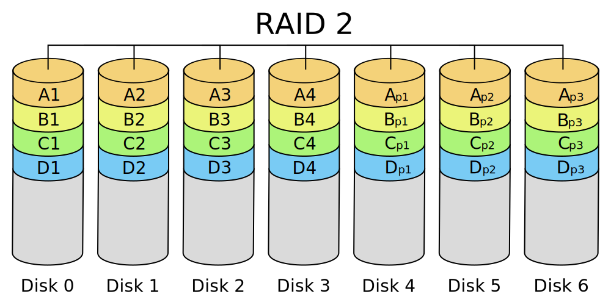
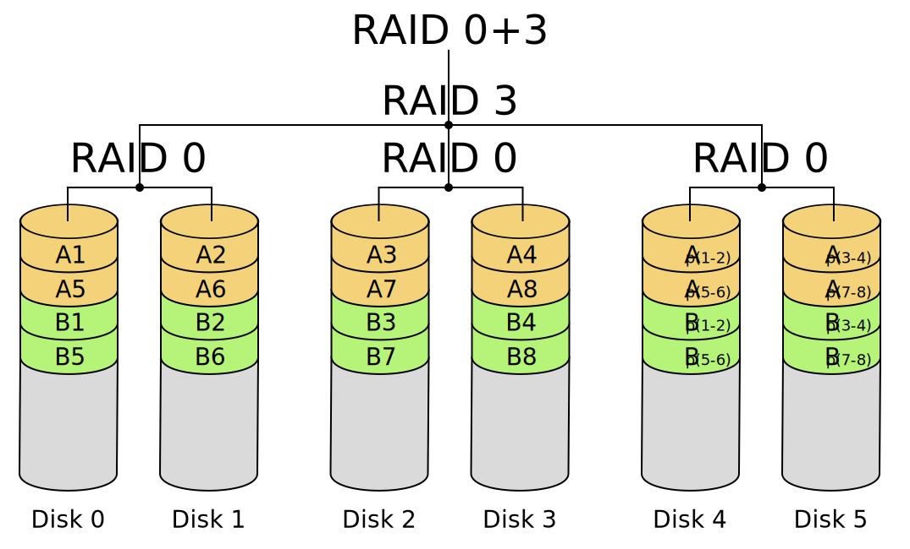
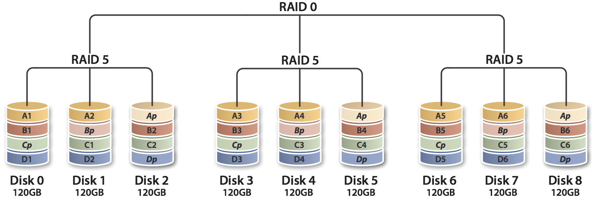
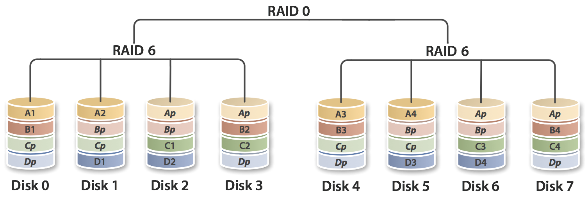
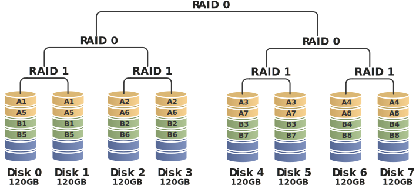

# DBA

Seguridad y Optimización de la BD

## DBA

### ¿Quien es un DBA?

Es el profesional responsable de administrar la base de datos

### Funciones

- Evalúa el ambiente, es decir, el Hardware, realiza instalación y
mantenmiento de MySQL según las necesidades operativas de la empresa
- Configura que los accesos se realizen de forma segura. Conexiones/IDE y
otras interfaces
- Mantiene un buen desempeño de la BD. Trabaja con los indices para mejorar
las consultas a la base de datos
- Almacenamiento/Respaldo de datos. Realiza los ***backups***
- Apoya al área de desarrollo con el mantenimiento de los datos. Elimina datos
no desados, desfragmentar la DB, entre otros
- Monitorea la instalación de MySQL. Gestiona los recursos usados por la BD y
la adecua a las necesidades de la los usuarios.
- Configura el ambiente y sus diversas propiedades (MySQL `my.ini`)
- Administra los usuarios que tendrán acceso a la DB. Otorga niveles de acceso

## Conexiones

### MariaDB

```sh
mariadb -u <USER> -h <HOST> [<DBNAME>] -P <PORT> -p
```
### MySQL

```sh
mysql -u <USER> -h <HOST> [<DBNAME>] -P <PORT> -p
```


## Detener servicio

### SystemD

```sh
systemctl stop mariadb
```

```sh
systemctl stop mysql
```

## Servicio de Windows

```sh
# C:\Windows\system32
> net stop mysql80
```

## Tuning

La puesta a punto de MySQL se puede realizar de 4 maneras

### 1. Esquemas, índices, variables interdas de MySQL (mysqld), Hardware y S.O.

  - HARDWARE
    - Utilizar sistemas operativos de 64-bits. Mysql puede usar procesamiento
    en paralelo y consumir toda la memoria
    - Configuración de RAM. Parametro que permite indicar el máximo de memoria
    disponible para los procesos. No se recomienda exceder el 50%
    - Dependiendo de la forma con la que se trabaje la base de datos va a variar
    su consumo de memoria
    - El tipo del disco: HDD, SSD, NVME
    - Conexión SATA, SAS, M2, PCIe.
    - Uso del controlador de disco **RAID** (0, 1, 5 y 10) para la seguridad
    de los datos
      - **RAID 0**: Divide los datos en dos HD diferentes, y actuan como un
      solo disco a nivel de S.O
      - **RAID 1**: Uno de los HD es copia del otro, y lo que realize en uno
      se replica automáticamente en el otro
      - **RAID 5**: Divide los datos en más de dos HD diferentes, y actuan
      como un solo disco a nivel de S.O
      - **RAID 10**: Los discos tiene ***espejos***, y lo que realize en uno
      se replica automáticamente en el otro
      - **RAID 1 y 10**: Utilizan mas espacio producto de la redundancia, pero
      son mas seguros por tener backup disponible


> RAID [wiki](https://en.wikipedia.org/wiki/Standard_RAID_levels)  
Nested RAID [wiki](https://en.wikipedia.org/wiki/Nested_RAID_levels)  
RAID [ArchWiki](https://wiki.archlinux.org/title/RAID)


<details><summary markdown="span">RAID</summary>

#### RAID 0

[](./imgs/RAID_0.svg)

#### RAID 1

[](./imgs/RAID_1.svg)

#### RAID 2

[](./imgs/RAID_2.svg)

#### RAID 3

[](./imgs/RAID_3.svg)

<details><summary markdown="span">Nested RAID</summary>

#### RAID 01 (RAID 0+1)

[](./imgs/RAID_01.svg)

#### RAID 03 (RAID 0+3)

[](./imgs/RAID_0+3.svg)

#### RAID 10 (RAID 1+0)

[](./imgs/RAID_1+0.svg)

#### RAID 50 (RAID 5+0)

[](./imgs/RAID_50.png)

#### RAID 60 (RAID 6+0)

[](./imgs/RAID_60.png)

#### RAID 100 (RAID 10+0)

[](./imgs/RAID_100.svg)

</details>

</details>

## Variables de ambiente MySQL

Estas variables establecen parametros de funcionamento predefindos. Existen mas
de 250 variables. Estas pueden cambiar según la versión de MySQL

`SHOW STATUS` muestra los valores actuales de las variables de ambiente

2 Tipos de variables de ambiente **GLOBAL** y **SESSION**

`my.ini` o `my.cnf`: Directivas para daemon(servicio) y client

[MySQL doc](https://dev.mysql.com/doc/refman/8.2/en/server-system-variables.html)  
[MariaDB doc](https://mariadb.com/kb/en/server-system-variables/)

```sql
SHOW GLOBAL STATUS LIKE '%tmp%tables%';
+-------------------------+-------+
| Variable_name           | Value |
+-------------------------+-------+
| Created_tmp_disk_tables | 338   |
| Created_tmp_tables      | 18175 |
+-------------------------+-------+
```

```sql
SHOW GLOBAL VARIABLES LIKE '%table_size%';
+-----------------------+----------------------+
| Variable_name         | Value                |
+-----------------------+----------------------+
| max_heap_table_size   | 16777216             |
| tmp_disk_table_size   | 18446744073709551615 |
| tmp_memory_table_size | 16777216             |
| tmp_table_size        | 16777216             |
+-----------------------+----------------------+

SET GLOBAL tmp_table_size = 33554432;

SHOW GLOBAL VARIABLES LIKE 'tmp_table_size';
+----------------+----------+
| Variable_name  | Value    |
+----------------+----------+
| tmp_table_size | 33554432 |
+----------------+----------+
```

Esta modificación es efímera, se pierde al reiniciar el servicio o maquina

Para establecer el valor de forma permanente editar archivos de configuración

### Debian

```sh
sudo vim /etc/mysql/mariadb.conf.d/50-server.cnf
```

```txt
#
# * Fine Tuning
#

tmp_table_size          = 33554432
```

### Windows

```
C:\ProgramData\MySQL Server 8.0\my.ini
```

## Mecanismos de Almacenamiento

Es la forma de almacenar la información en las tablas

MySQL 8.0 Community dispone 9 mecanismos para almacenar datos

Una misma DB puede usar diversos mecanismos en sus tablas

### ENGINE

Es el parametro que indica el mecanismo de almacenamiento

### MyISAM

- No es transaccional. No esta diseñado para que varios usuarios realicen
  operaciones en las tablas simultaneamente
- Solo permite el bloqueo a nivel de tabla (Lectura mas rápida)
- Recomendada para tablas que no estan en continio cambio
- La clave externa no soporta Full Text
- Almacena datos de manera mas compacta (Optimiza espacios de almacenamiento)
- Implementa índices `HASH` y `BTREE`
- `key_buffer_size`: Determina el tamaño de cache para almacenar los indices
  MyISAM. Varía de 8MB a ~4GB según el S.O.
- `concurrent_insert`: Comportamiento de inserciones concurrentes dentro de
  tabla MyISAM
  - `0`: Inserciones simultaneas desactivdas
  - `1`: Inserciones simultaneas sin intervalo de datos (Al mismo tiempo)
  - `0`: Inserciones simultaneas con intervalo de datos
- `delay_key_write`: Atraso entre la actualización de índices y el momento
en que se crea la tabla (Espera a que todos los registros sean insertados
para despues actualizar los indices. Mas consistencia. Menos rapidez)
- `max_write_lock_count`: Dertermina el número de grabaciones en las tablas
que tendrán precedencia a las lecturas (Prioriza la cantidad de grabaciones
que se realizaran antes de las lecturas en varias conexiones)
- `preload_buffer_size`: Tamaño del buffer a ser usando antes de cargar los
índices de claves de las tablas. 32KB
- El uso de estas variables de ambiente se realiza en la medida de lo
necesario. Lo recomendable es usar esos valores por defecto
- `myisamchk`: Analiza, optimiza y repara tablas MyISAM (las reconstruye)
- `myisampack`: Crea tablas compactadas solo para lectura
- `myisam_ftpdump`: Muestra información completa de los campos tipo texto

### InnoDB

- Mecanismo de almacenamiento transaccional más utilizado en MySQL
- Esta diseñado para que varios usuarios realicen operaciones simultaneas sobre las
tablas
- Soporte transaccional completo. Soporte a claves externas
- Cache de buffer configurado de forma separada tanto para la base como para el
índice
- Bloqueo de tabla a nivel de línea
- Indexacion **BTREE**
- Back-up de la DB online. Sin bloqueo
- **Tablas**
  - `innodb_data_file_path`: Determina la ruta y tamaño máximo del archivo
  dentro del sistema donde se almacena la información
  - `ìnnodb_data_home_dir`: Ruta común de todos los archivos innodb. Cuando
  se especifica, guarda todo dentro de ese directorio (default `mysqldata`)
  - `innodb_file_per_table`: Separa el almacenamiento de datos e indices. Por
  defecto almacena datos e índices de forma compartida
- **Desempeño**
  - `innodb_buffer_poll_size`: Tamaño de almacenamiento usado para indices y
  datos en cache
  - `innodb_flush_log_at_trx_commit`: Frecuencia de escritura del log-in en el
  disco
  - `innodb_log_file_size`: Tamaño en Bytes de archivos log-in (default 5MB)

### MEMORY

- Mecanismo de almacenamiento que crea las tablas en la memoria RAM, no en disco
- No soporta clave externa
- Acceso muy rápido a la información
- Los datos necesitan ser reinicializados junto con el servidor
- Bloqueo a nivel de tabla
- Indice utiliza HASH por defecto y BTREE
- Formato de linea de longitud fija. No soporta `BLOB`/`TEXT`

## Usando ENGINE

```sql
CREATE TABLE df_table (id INT, nombre VARCHAR(100));

ALTER TABLE df_table ENGINE = MyISAM;

/* MariaDB */
SHOW ENGINES;
+--------------------+---------+-------------------------------------------------------------------------------------------------+--------------+------+------------+
| Engine             | Support | Comment                                                                                         | Transactions | XA   | Savepoints |
+--------------------+---------+-------------------------------------------------------------------------------------------------+--------------+------+------------+
| CSV                | YES     | Stores tables as CSV files                                                                      | NO           | NO   | NO         |
| MRG_MyISAM         | YES     | Collection of identical MyISAM tables                                                           | NO           | NO   | NO         |
| MEMORY             | YES     | Hash based, stored in memory, useful for temporary tables                                       | NO           | NO   | NO         |
| Aria               | YES     | Crash-safe tables with MyISAM heritage. Used for internal temporary tables and privilege tables | NO           | NO   | NO         |
| MyISAM             | YES     | Non-transactional engine with good performance and small data footprint                         | NO           | NO   | NO         |
| SEQUENCE           | YES     | Generated tables filled with sequential values                                                  | YES          | NO   | YES        |
| InnoDB             | DEFAULT | Supports transactions, row-level locking, foreign keys and encryption for tables                | YES          | YES  | YES        |
| PERFORMANCE_SCHEMA | YES     | Performance Schema                                                                              | NO           | NO   | NO         |
+--------------------+---------+-------------------------------------------------------------------------------------------------+--------------+------+------------+
```

### Creando una base de datos

```sql
CREATE DATABASE base DEFAULT CHARACTER SET utf8mb4 COLLATE utf8mb4_general_ci;
-- o también
CREATE DATABASE base DEFAULT CHARACTER SET utf8mb4 COLLATE utf8mb4_general_ci;
```

### Directorio de las BBDD

```sql
VARIABLES WHERE Variable_Name LIKE '%dir';
    +---------------------------+----------------------------+
    | Variable_name             | Value                      |
    +---------------------------+----------------------------+
    | aria_sync_log_dir         | NEWFILE                    |
    | basedir                   | /usr                       |
    | character_sets_dir        | /usr/share/mysql/charsets/ |
==>>| datadir ------------------| /var/lib/mysql/ -----------|<<==
    | innodb_data_home_dir      |                            |
    | innodb_log_group_home_dir | ./                         |
    | innodb_tmpdir             |                            |
    | lc_messages_dir           |                            |
    | plugin_dir                | /usr/lib/mysql/plugin/     |
    | slave_load_tmpdir         | /tmp                       |
    | tmpdir                    | /tmp                       |
    | wsrep_data_home_dir       | /var/lib/mysql/            |
    +---------------------------+----------------------------+
```

`sudoedit /etc/mysql/mariadb.conf.d/50-server.cnf`

```sh
#
# * Basic Settings
#

...
datadir                 = /var/lib/mysql
```

## Backup

### Back-up lógico

Exporta todas las estructuras, tablas, rutinas, etc. a un script sql. Este
permite recrear la base de datos. Es lento ya que se ejecuta comando a
comando

### Back-up físico

Contiene todos los archivos binarios del sistema donde esta almacenada la
información. Es más rápido pero no permite edicion antes de su restauración

### `mysqldump`

Más [information](https://dev.mysql.com/doc/refman/en/mysqldump.html)

```sh
  - Create a backup (user will be prompted for a password):
    mysqldump --user user --password database_name --result-file=path/to/file.sql

  - Backup a specific table redirecting the output to a file (password prompted):
    mysqldump --user user --password database_name table_name > path/to/file.sql

  - Backup all databases redirecting the output to a file (password prompted):
    mysqldump --user user --password --all-databases > path/to/file.sql

  - Backup all databases from a remote host,
    redirecting the output to a file (password prompted):
    mysqldump --host=ip_or_hostname --user user --password --all-databases > path/to/file.sql

  --routines --events
```

MariaDB usa **mariadb-dump**
[`mariadb-dump --help`](./proyecto_scripts/mariadb-dump--help.txt)

```sh
mysqldump -u <user> -p<password> --databases <db_name> > out.sql
```

### LOCK

MariaDB

```sql
-- To lock a table:
BACKUP LOCK table_name

-- To unlock a table:
BACKUP UNLOCK
```

MySQL

```sql
LOCK instance for backup;

UNLOCK INSTANCE;
```
