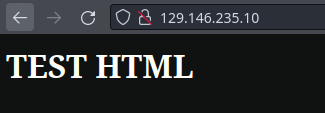

# Oracle Cloud Infrastructure

## Cloud Computing

Basicamente es el uso de servicio como servidores, almacenamiento, redes, bases
de datos y otros recursos computacionales a través de internet.


### Beneficios de uso de la Nube

1. Costos
2. Velocidad
3. Escalabilidad
4. Productividad
5. Desempeño
6. Confiabilidad
7. Seguridad

### Tipos de Nube

- Nube Publica
- Nube Privada
- Nube Híbrida

### Tipos de servicios en la Nube

- **IaaS** Infrastructure as a Service

  El tipo más común de servicio en la Nube.
  Bajo laaS, el proveedor de la Nube proporciona la infraestructura de TI, como
  servidores, almacenamiento y redes, y se paga de acuerdo al uso.
  La mayoría de los recursos de TI ofrecidos en el modelo IaaS no están
  pre-configurados, lo que significa que el consumidor tiene un alto grado de
  control sobre el entorno en la Nube. Él es quien debe configurar y mantener
  cualquier software que desee ejecutar sobre la infraestructura provista.

  El IaaS ganó fuerza significativa en los últimos años, especialmente con
  startups y divisiones independientes de empresas más grandes que tuvieran un
  crecimiento rápido y busquen construir sus propias aplicaciones esenciales
  para el negocio, pero evitan la inversión y el mantenimiento que la
  infraestructura requerirá.

  Además se trata de empresas que muchas veces buscan escalabilidad inmediata,
  ya que por el rápido crecimiento, necesitan estar preparados para lidiar con
  un volumen cada vez mayor de trabajo. Con IaaS existe la posibilidad de
  comprar un nuevo servidor virtual, instalarlo por cuenta propia y obtener esa
  capacidad adicional en una porción de tiempo mas pequeño.

- **PaaS** Platform as a Service

  PaaS (que significa plataforma como servicio) es un modelo informático en el
  cual el proveedor de la Nube te asigna, configura y gestiona toda la
  infraestructura informática, como servidores, redes como en IaaS, así como
  sistemas operativos, bases de datos, herramientas de desarrollo y
  administración de empresas.

  En otras palabras, en PaaS toda la configuración de la base de datos, la
  seguridad y las replicaciones son realizadas por el proveedor con pocos
  márgenes de configuración, diferente de IaaS, donde las principales
  configuraciones son hechas por el desarrollador, lo que hace que PaaS sea
  más costosa que IaaS.

  PaaS es un ambiente de informático listo para su uso, una vez que los
  recursos y servicios ya están implementados y configurados. Los servicios
  informáticos PaaS incluyen aquellos que lo ayudan a desarrollar, probar y
  entregar aplicaciones de software personalizadas.

  Los desarrolladores pueden crear sus aplicaciones rápidamente y un proveedor
  de la Nube configura y administra la infraestructura informática subyacente.
  El consumidor puede reemplazar todo el ambiente informático local por el de
  PaaS o usar PaaS para expandir su ambiente de TI y/o reducir costos con el
  ambiente en la nube.

- **SaaS** Software as a Service

  SaaS es como un proveedor de la Nube que ofrece aplicaciones de software bajo
  demanda. En este modelo, el proveedor administra no solo la infraestructura
  sino también las aplicaciones de software y los usuarios que se conectan a
  la aplicación a través de internet.

  El software se modela como un servicio de la Nube compartido y disponible
  para los usuarios como un producto. Los consumidores de la Nube tienen el
  control administrativo y de gestión limitado.

  Un ejemplo bien conocido de SaaS es Spotify, que es un servicio de música de
  streaming, podcast y video que fue lanzado en Octubre de 2008 en Estocolmo,
  Suecia. Es el servicio de streaming más popular y mas usado en todo el mundo.

  SaaS es esencialmente la entrega de aplicaciones directamente de la Nube para
  usuarios individuales. El hardware que procesa los datos como así también el
  sistema operativo y no le importará nada para los usuarios finales. que
  acceden a estas aplicaciones a través de una plataforma como Chrome, Firefox,
  Safari, Google Play o Apple Store.

  Organizaciones de todos los tamaños han migrado a SaaS. ¿Y por que no?, Por
  lo tanto no necesitan invertir en mucho hardware y sistemas operativos caros.
  Además, no tienen que pagar un equipo de TI para mantener la infraestructura
  o solucionar problemas de las aplicaciones.

  El proveedor de SaaS ofrece todo eso. En caso de no utilizar un proveedor de
  SaaS, las empresas necesitan comprar una licencia perpetua para ejecutar una
  aplicación de software en sus sistemas.

- **Serverless** λ

> Lectura
[¿Que es Cloud?](https://www.aluracursos.com/blog/que-es-cloud-y-sus-principales-servicios)


### Principales proveedores

- [AWS](https://aws.amazon.com/)

- Microsoft [Azure](https://azure.microsoft.com/)

- [Google Cloud Platform](https://cloud.google.com/)

- Oracle Cloud Infrastructure [OCI](https://www.oracle.com/es/cloud/)


## Cloud Shell

```txt
Welcome to Oracle Cloud Shell.

Upgrade Notification: In the near future your Cloud Shell session will be hosted
on virtual machines based on the ARM64 architecture. Most users will be given the
option to choose the VM architecture for their session. Cloud Shell will also be
upgrading to Oracle Linux 8. Stay tuned for further updates.

The OCI Ruby SDK will no longer be preinstalled in Cloud Shell. To install the
OCI Ruby SDK, see https://github.com/oracle/oci-ruby-sdk.

NOTICE: The Metadata Service 1 endpoint is deprecated and will soon be disabled.
When accessing the Metadata Service from Cloud Shell, use the Metadata Service 2
endpoint. For more information,
see https://docs.oracle.com/en-us/iaas/Content/Compute/Tasks/gettingmetadata.htm

Your Cloud Shell machine comes with 5GB of storage for your home directory. Your
Cloud Shell (machine and home directory) are located in: US West (Phoenix).
You are using Cloud Shell in tenancy <USER> as an OCI local user <USUARIO>

Type `help` for more info.
=================================================================================

Welcome to the Oracle Cloud Shell Tutorial

Cloud Shell is a web-based terminal which includes many useful tools including
current versions of the OCI CLI and SDKs.
Would you like to run a tutorial to learn more about all the features included in
Cloud Shell? (Type N to quit) [Y|N] 
```

## Cloud Shell tutorial

<details>

<summary markdown="span"><b>Tutorial</b></summary>

### About This Tutorial

```txt
This is a command line tutorial that runs the first time you start Cloud Shell
and provides a quick introduction to the service. You can quit this tutorial at
any time.
If you would like to run it again, you can do that by typing cstutorial in your
Cloud Shell terminal at any time.
```

### This tutorial is going to cover

```txt
    *  How to use Cloud Shell
    *  Identifying tools available in Cloud Shell
    *  Programming language support from Cloud Shell and how to manage your
       Java Development Kit (JDK) versions
    *  Running OCI Command Line Interface (CLI) Commands and using OCI's
       Interactive CLI
    *  Using the OCI SDKs
```

### What is Cloud Shell?

```txt
Cloud Shell is a free web browser-based terminal accessible from the Oracle Cloud
Console that is pre-installed with a set of useful tools. Each user is provided a
5 GB home directory which provides persistent storage for your files.

Cloud Shell allows you to perform tasks including:

    *  Writing Linux scripts for managing your Oracle Cloud Infrastructure (OCI)
       environment
    *  Developing or running applications built using the OCI SDKs
    *  Building and running docker containers
    *  Managing your Oracle Cloud Infrastructure (OCI) Functions
    *  Accessing public and private resources including:
        *  Running OCI CLI commands to manage your resources
        *  Accessing your Oracle Container Engine for Kubernetes clusters
        *  Accessing your compute instances using ssh
        *  Managing your Autonomous Databases

Your persistent home directory allows you to store scripts and files in your
Cloud Shell which will be retained for your next session even if you exit or
restart Cloud Shell. Those files live in your Cloud Shell environment and can
not be accessed by other users.

The OCI CLI is pre-configured to run as you with all of the policies and
privileges that have been assigned to you by your Administrator. No additional
set up is required to use it.
```

### Tools Available in Cloud Shell

```txt
CloudShell provides a collection of pre-installed and pre-authenticated tools
readily accessible to users which are updated on a regular basis including:

    *  OCI Command Line Interface (CLI)
    *  Source Code Management: Git
    *  SQL: SQLcl, mysql-community-client
    *  Kubernetes utilities: kubectl, helm
    *  Build tools: maven, make
    *  Provisioning and configuration management: terraform, ansible
    *  Editors: vim, nano, emacs
    *  Linux Shells: bash, sh, tmux
    *  Linux utilities: iputils, jq, wget, zip/unzip, tar (and many more)
    *  Python tools: pip, iPython
    *  Typescript/Javascript support: node.js, NPM, nvm
    *  Docker: Docker engine
    *  oci-powershell-modules
    *  GoldenGate Admin client
```

### Using the OCI Command Line Interface (CLI)

```txt
Included in Cloud Shell is a current version of the OCI CLI. The CLI is a
small-footprint tool that you can use on its own or with the Console to complete
Oracle Cloud Infrastructure 
tasks. The CLI provides the same core functionality as the Console, plus
additional commands. Some of these, such as the ability to write and run scripts,
extend Console functionality.

Cloud Shell updates the version of the OCI CLI on a regular basis. This means you
are always using the latest version of our tools. We also automatically configure
your credentials when 
you launch Cloud Shell so no further setup is required to use the OCI CLI in
Cloud Shell. Authentication happens automatically.

Hit return to run the oci command oci iam availability-domain list : 

$ oci iam availability-domain list
```

### Using the OCI CLI in Interactive Mode

```txt
The CLI also has an interactive mode that simplifies your OCI CLI user experience
with several new features, including command and parameter suggestions,
auto-completion, and command reference information.

In interactive mode, suggestions will be made as you navigate the command line.
For example, it can help find the right arguments for a command, and fill in
ocids by allowing you to search based on display names.

An example of a command you can run is oci iam availablity-domain list.

To try that now, and go into interactive mode, type oci -i and then hit Return.

And then try the following:

    1. Type in iam and then a space. The CLI will give you a list of choices.
    2. Type avail and then hit tab to autocomplete the command
    3. Type a space and then list and then hit return to finish the command


Type oci -i to go into interactive mode:
$ oci -i
Learn more about interactive features in CLI by watching our informative video
on YouTube
-> https://www.youtube.com/watch?v=lX29Xw1Te54&ab_channel=OracleLearning
Also see
https://docs.oracle.com/iaas/Content/API/SDKDocs/cliusing_topic-Using_Interactive_Mode.htm
> oci
```

### Using Docker

```txt
You can use Docker from within Cloud Shell to develop software.

Hit return to docker run hello-world:

$ docker run hello-world

Hello from Docker!
This message shows that your installation appears to be working correctly.

To generate this message, Docker took the following steps:
 1. The Docker client contacted the Docker daemon.
 2. The Docker daemon pulled the "hello-world" image from the Docker Hub.
    (amd64)
 3. The Docker daemon created a new container from that image which runs the
    executable that produces the output you are currently reading.
 4. The Docker daemon streamed that output to the Docker client, which sent it
    to your terminal.

To try something more ambitious, you can run an Ubuntu container with:
 $ docker run -it ubuntu bash

Share images, automate workflows, and more with a free Docker ID:
 https://hub.docker.com/

For more examples and ideas, visit:
 https://docs.docker.com/get-started/
```

### Supported Programming Languages

```txt
We support the following programming languages in Cloud Shell so you can write
your own applications:

    *  Java including multiple versions of Oracle Java as well as
       GraalVM Enterprise JDK 17
    *  Python (2 and 3)
    *  Ruby
    *  Golang
    *  JavaScript/NodeJS
    *  C/C++ using gcc
    *  sh and bash scripts
```

### Using the OCI Software Development Kits (SDKs)

```txt
The OCI Software Development Kits (SDKs) allow you to build and deploy apps that
integrate with Oracle Cloud Infrastructure services. Each SDK provides the tools
you need to develop an app, including code samples and documentation to create,
test, and troubleshoot. In addition, if you want to contribute to the development
of the SDKs, they are all open source and available on GitHub.

Cloud Shell installs and updates the version of the OCI SDKs on a regular basis.
This means you are always using recent versions of our tools. We also
automatically configure your credentials when you launch the Cloud Shell so you
do not have to set up keys if you use the default authentication provider.

To get up and running quickly, you can look at the SDK Cloud Shell Quick Starts
for each of the languages:
  https://docs.oracle.com/en-us/iaas/Content/API/Concepts/developerquickstarts.htm


You can also find source and examples on GitHub for the SDKs.
  *  Java:                  https://github.com/oracle/oci-java-sdk
  *  Python:                https://github.com/oracle/oci-python-sdk
  *  Typescript/JavaScript: https://github.com/oracle/oci-typescript-sdk
  *  .NET:                  https://github.com/oracle/oci-dotnet-sdk
  *  Go:                    https://github.com/oracle/oci-go-sdk
  *  Ruby:                  https://github.com/oracle/oci-ruby-sdk
```

### Code Editor

```txt
Cloud Shell integrates seamlessly with the OCI Code Editor, allowing you to edit
code, modify scripts, and update service workflows directly from the OCI Console.

The Code Editor lets you browse, view, and edit files in your Cloud Shell home
directory and provides a convenient way to perform common code updates for
various services, including creating and deploying Functions, editing Terraform
configurations used with Resource Manager stacks, and creating and editing an API.
It offers the following capabilities that enhance your productivity:

  *  Built-in integration with OCI services, including Functions,
     Resource Manager, and Data Science
  *  Access to Cloud Shell and 30+ cloud-based tools
  *  Git integration and workspace management
  *  Rich language support
  *  Session continuity
  *  Personalized user experience

You can access this from the View menu in the Cloud Shell window or directly from
the Developer Tools icon in the Console header.
```

### Configuring Java Versions

```txt
You can use csruntimectl to configure your version of Java.

To see the set of available Java versions see `csruntimectl java list`.
Your current JDK is indicated by an *.
Hit return to list the JDKs available on this system:

$ csruntimectl java list
   graalvmeejdk-17                /usr/lib64/graalvm/graalvm22-ee-java17
 * oraclejdk-11                                    /usr/java/jdk-11.0.17
   oraclejdk-1.8                         /usr/lib/jvm/jdk-1.8-oracle-x64


You can then set the JDK version by using the command
`csruntimectl java set <version from above>`

Hit return to show your current JAVA_HOME: 

$ echo $JAVA_HOME
/usr/lib64/graalvm/graalvm22-ee-java17
```

### Transferring Files to and from your Cloud Shell

```txt
In addition to creating new files and scripts, you can upload files to and
download files from your Cloud Shell.

Under the tools (aka gear) icon on the top right corner of the Cloud Shell header
are three options related to File Upload/Download:

  *  Download - allows you to transfer files from your Cloud Shell to your local
     computer
  *  Upload - allows you to transfer files from to Cloud Shell from your local
     computer
  *  File Transfers - allows you to view active and completed Uploads and
     Downloads

To Upload files, you can either drag an drop files into the upload dialog (or
even directly into Cloud Shell) or use the file selection dialog to select
individual files.

Try dragging a file into the Cloud Shell window to try to upload now.

To Download files, you will have to enter the path starting at your home
directory in the dialog box. For example, if your file was in ~/temp/myfile you
would enter temp/myfile.
```

### Understanding Regions

```txt
Your Cloud Shell host (and your home directory) live in the Home Region for your
tenancy regardless of what region is selected in the region pull-down menu in the
top right corner of the console. This allows your home directory to be available
no matter what region you are operating in.

Your current region (the region you have selected in the pull-down) is used when
accessing tenancy resources using the OCI Command Line Interface (CLI) or the OCI
Software Development Kits (SDKs).

In the current Cloud Shell Session:

  *  Your Home region is us-phoenix-1
  *  Your Console selected region is us-phoenix-1


Note: The region used by the SDKs/CLIs is "sticky" based on what was selected in
the console when your Cloud Shell was opened and persists as long as the session
exists. You can identify what region is active by looking at the Cloud Shell
prompt. It will look like:

    <username>@cloudshell:<directory> (<region>)

If you want to change your region for the CLI/SDK:

  *  Select a new region in the Console region pull-down menu, near the top of
     the Console.
  *  Close and reopen your terminal.
```

### Understanding Network Access from your Cloud Shell

```txt
By default, your Cloud Shell uses our Public Network which is provisioned with
both a Service Gateway and additionally has egress to the internet. From your
Cloud Shell Public Network connection, you can run OCI CLI commands to access
tenancy resources and also reach public resources. The access to public resources
allows you to perform tasks like using ssh to access public instances, managing
public OKE Clusters and pulling from public git repositories.

If you would like to access resources which do not have a public IP, you can
instead use a Private Network Connection. Using Private Network Access, you can
connect to a subnet (assuming your administrator has granted you permission) that
lives in your home region.

See:
https://docs.oracle.com/en-us/iaas/Content/API/Concepts/cloudshellintro.htm#Cloud_Shell_Private_Access

Note: No ingress to your Cloud Shell Hosts (in either public or private networks)
is supported.
```

### Getting More Information

```txt
You can find out more about Cloud Shell, the CLI and the SDKs here:

  *  Cloud Shell Overview:
     https://docs.oracle.com/en-us/iaas/Content/API/Concepts/cloudshellintro.htm
  *  OCI CLI Overview:
     https://docs.oracle.com/iaas/Content/API/Concepts/cliconcepts.htm
  *  OCI Interactive CLI Overview:
     https://docs.oracle.com/en-us/iaas/Content/API/SDKDocs/cliusing_topic-Using_Interactive_Mode.htm
  *  OCI SDKs Guides:
     https://docs.oracle.com/en-us/iaas/Content/API/Concepts/sdks.htm
  *  OCI SDKs Cloud Shell Quickstarts:
     https://docs.oracle.com/en-us/iaas/Content/API/Concepts/developerquickstarts.htm
  *  Oracle Cloud Infrastructure CLI Command Reference:
     https://docs.oracle.com/en-us/iaas/tools/oci-cli/latest/oci_cli_docs/
```

```txt
Thank you for running our tutorial, and welcome to Cloud Shell!
```

</details>

### Official Docs

- [Video](https://youtu.be/JBkT44FSf0o) introducción OCI -
[Docs](https://docs.oracle.com/es-ww/iaas/Content/GSG/Concepts/baremetalintro.htm)

- Video [Compartments](https://youtu.be/VJD19vyu6lI) -
[Docs](https://docs.oracle.com/es-ww/iaas/Content/Identity/compartments/managingcompartments.htm)

- Video Identity & Access [Management](https://youtu.be/8qaQuoJZYvQ) -
[Docs](https://docs.oracle.com/es-ww/iaas/Content/Identity/iam/manage-iam.htm)

- Playlist
[Networking](https://www.youtube.com/playlist?list=PLvlciYga5j3z7biGjV7-fywS-xEJ3W6Pp) -
[Docs](https://docs.oracle.com/es-ww/iaas/Content/Network/Concepts/landing.htm#top)

  

- Playlist
[Compute](https://www.youtube.com/playlist?list=PLKCk3OyNwIzsAjIaUaVsKdXcfBOy6LASv) -
[Docs](https://docs.oracle.com/es-ww/iaas/Content/home.htm)

## Oracle Linux 9

Luego de crear la instancia, y una llave pública

### Instalación paquete httpd

```sh
sudo yum -y install httpd
```

### Configuración de Firewall

```sh
sudo firewall-cmd --permanent --add-port=80/tcp
sudo firewall-cmd --reload
```

### Iniciar servicio httpd

```sh
sudo systemctl start httpd
```

### Cambiar a usuario root

```sh
sudo su
```

### HTML básico

`/var/www/html/index.html`

```html
<h1>TEST HTML</h1>
```

### Edit Default Security List for VCN


### Crear otra instancia para usar load balancer

Se crea una identica a la anterior (free tier)

### Load Balancer





- Video [Load Balancer](https://www.youtube.com/watch?v=tY2UuVbDElc) -
Docs [OCI](https://docs.oracle.com/es-ww/iaas/Content/home.htm)

----

## [OCI 2da Parte](./oci2.md)
