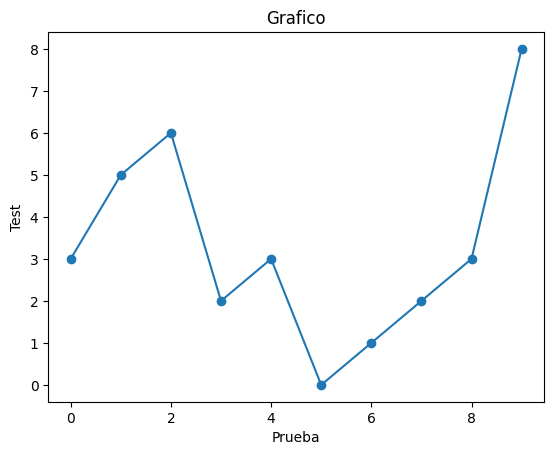

# Python

[Wiki](https://en.wikipedia.org/wiki/Python_%28programming_language%29)
Python [Docs](https://docs.python.org/es/3/)

## Ambiente

Se utiliza la herramienta de Google **Colaboratory**, similar a un ***Jupiter
Notebook***, que no requiere de alguna configuración previa. Salvo una cuenta
de gmail.

Cada notebook virtual se almacena en Google Drive

- El código de tu Notebook se ejecuta en una máquina virtual dedicada a la
cuenta. Las máquinas virtuales se reciclan después de un cierto tiempo de
inactividad, o si la ventana está cerrada
- Para restaurar un Notebook, es posible que debas cargar el archivo `.csv` y
ejecutar las opciones ***Tiempo de ejecución*** y ***Reiniciar y ejecutar
todas ...***
- Artículo en
[Alura](https://www.aluracursos.com/blog/google-colab-que-es-y-como-usarlo)

#### Google [Colab](https://colab.research.google.com/notebooks/intro.ipynb)

## Python para DS - Introducción al lenguaje

[Notebook](https://colab.research.google.com/drive/1st2KDsR4cyzu6ZCsDIZzIc5AiQ_rHdh9?usp=sharing)

```py
name = 'DevFzn'

print(name)
```

```
DevFzn
```

### Función

```py
def pregunta():
    name = input("Cual es tu nombre?:\n ")
    num = input("Elige un número:\n ")
    print(f'Hola {name}, tu número es el {num}')
```

Llamando a la función

```py
pregunta()
```

```
Cual es tu nombre?:
 DevFzn
Elige un número:
 3
Hola DevFzn, tu número es el 3
```

### Función con parametro

```py
def func_param(nombre):
    print(f'Hola {nombre}')

func_param('DevFzn')
```

```
Hola DevFzn
```

#### Función velocidad

```py
def velocidad(distancia, tiempo):
    v = distancia/tiempo
    print(f'La velocidad es {v} m/s')

velocidad(100,200)
```
La velocidad es 0.5 m/s
```

```

### Condiciones

```py
edad = 20
def conducir(edad):
    if edad >= 18:
        print('Puedes conducir')
    else:
        print('Aún no puedes conducir')

conducir(edad)
```

```
Puedes conducir
```

```py
edad = 17
conducir(edad)
```

```
Puedes conducir
```

### Conversión de dato

```py
def conducir_sin_param():
    edad = int(input('Ingresa tu edad: '))
    conducir(edad)

conducir_sin_param()
```

```py
Ingresa tu edad: 16
Aún no puedes conducir
```

```py
conducir_sin_param()
```

```
Ingresa tu edad: 35
Puedes conducir
```

### Lista

```py
edades = [15, 18, 12, 50, 40]
type(edades)
```

```
list
```

```py
type(name)
```

```
str
```

Indice de lista

```py
# Largo de la lista
len(edades)

print(edades[0])
print(edades[1])
print(edades[2])
print(edades[3])
print(edades[4])
```

```
15
18
12
50
40
```

#### Slicing

```py
# Tres primeros valores
edades[0:3]
```

```
[15, 18, 12]
```

```py
# Desde la 3ra hasta el final
edades[2:]
```

```
[12, 50, 50]
```

```py
# La última
edades[-1]
```

```
40
```

### Ciclo For

```py
for edad in edades:
    conducir(edad)
```

```
Aún no puedes conducir
Puedes conducir
Aún no puedes conducir
Puedes conducir
Puedes conducir
```

### Boleano

```py
validaciones = []
def conducir_bool(validaciones, edades):
    for edad in edades:
        if edad >= 18:
            validaciones.append(True)
        else:
            validaciones.append(False)
    for valid in validaciones:
        if valid:
            print('Puedes conducir')
        else:
            print('Aún no puedes conducir')
conducir_bool(validaciones, edades)
```

```
Aún no puedes conducir
Puedes conducir
Aún no puedes conducir
Puedes conducir
Puedes conducir
```

#### Lista con distintos tipos de datos

```py
lista_mixta = [ 'Juan', 16, False, 'Brasil']
for elemento in lista_mixta:
    print(f'El elemento {elemento} de la lista es del tipo {type(elemento)}')
```

```
El elemento Juan de la lista es del tipo <class 'str'>
El elemento 16 de la lista es del tipo <class 'int'>
El elemento False de la lista es del tipo <class 'bool'>
El elemento Brasil de la lista es del tipo <class 'str'>
```

### Imports

```py
from random import randrange

rand_nums = []
for _ in range(10):
    rand_nums.append(randrange(0,11))
print(rand_nums)
```

```
[4, 4, 10, 5, 4, 9, 5, 2, 3, 6]
```

### Random seed

Con seed los números generados son siempre los mismos

```py
from random import seed

alea_nums = []
seed(8)
for _ in range(10):
    alea_nums.append(randrange(0,11))
print(alea_nums)
```

```
[3, 5, 6, 2, 3, 0, 1, 2, 3, 8]
```

### Matplotlib

```py
import matplotlib.pyplot as plt

x = list(range(0,10))
print(x)
alea_nums

plt.plot(x, alea_nums, marker='o')
plt.xlabel("Prueba")
plt.ylabel("Test")
plt.title("Grafico")
plt.show()
```


